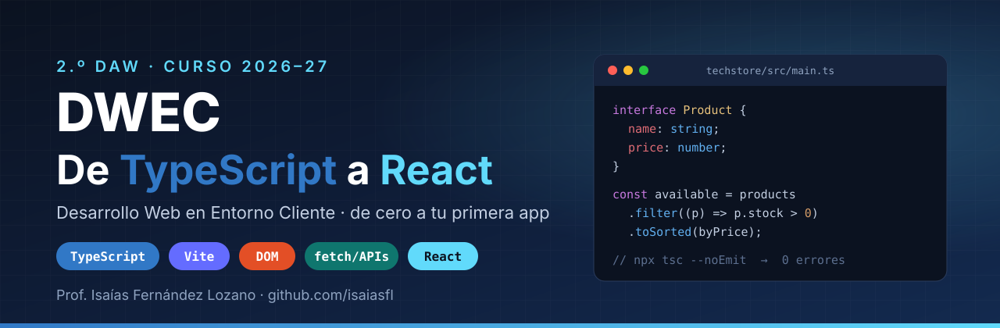
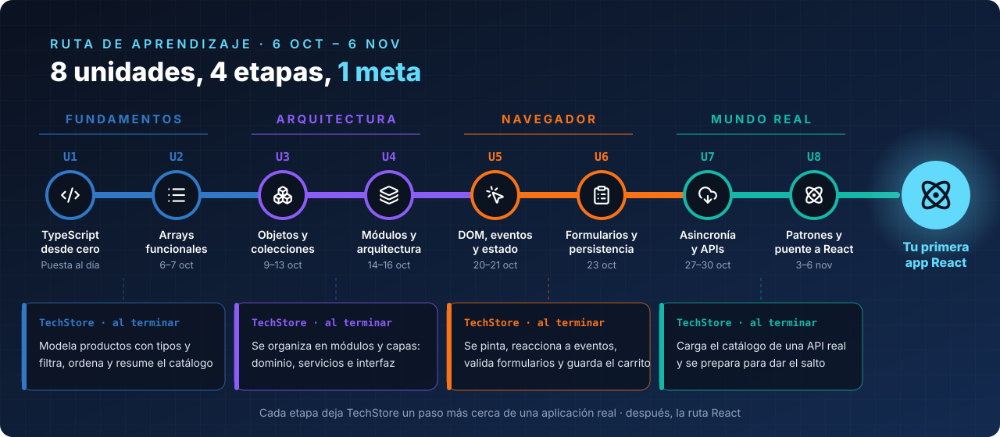
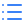

<p align="center">
  
</p>

<p align="center">
  
  
  
  
</p>

<p align="center">
  <b>Desarrollo Web en Entorno Cliente</b> · Prof. <a href="https://github.com/isaiasfl"><b>Isaías Fernández Lozano</b></a>
</p>

---

> **Aquí no se viene a copiar código: se viene a entenderlo.**
> En ocho unidades pasarás de escribir tu primer tipo en TypeScript a levantar una aplicación React
> que consume una API real. Cada línea que escribas tendrá un porqué, y el compilador será tu primer
> compañero de equipo: si `tsc` no protesta, vas por buen camino.

##  Qué vas a construir

Durante todo el curso desarrollarás **TechStore**, una tienda de tecnología que crece contigo, unidad a unidad:

| Etapa | Tu TechStore sabe... |
|---|---|
| **U1–U2** | modelar productos con tipos y filtrarlos, ordenarlos y resumirlos con arrays funcionales |
| **U3–U4** | organizarse en módulos con una arquitectura limpia: dominio, servicios e interfaz separados |
| **U5–U6** | pintarse en el navegador, reaccionar a eventos, validar formularios y recordar el carrito |
| **U7** | cargar el catálogo desde una API REST real ([DummyJSON](https://dummyjson.com)), con estados de carga y error |
| **U8** | dar el salto a **React**: componentes, props, estado y efectos |

##  Stack tecnológico

<p align="center">
          
</p>

| Capa | Lo que dominarás |
|---|---|
| **Lenguaje** | TypeScript estricto: tipos, interfaces, uniones, genéricos, *narrowing*, utility types |
| **Datos** | `map`, `filter`, `reduce`, `toSorted`, `Map`, `Set`, inmutabilidad |
| **Arquitectura** | módulos ES, capas, funciones puras, una sola fuente de verdad |
| **Navegador** | DOM, eventos y delegación, formularios, `FormData`, `localStorage` |
| **Red** | `async`/`await`, `fetch`, `AbortController`, validación de lo que llega de fuera |
| **Herramientas** | Vite, npm, `tsc --noEmit`, Git y GitHub |
| **Framework** | React con TypeScript: componentes, props, `useState`, `useEffect` |

##  Hoja de ruta

<p align="center">
  
</p>

El mismo recorrido, unidad a unidad:

```mermaid
flowchart LR
    U1[U1 · TypeScript<br/>desde cero] --> U2[U2 · Arrays<br/>funcionales]
    U2 --> U3[U3 · Objetos y<br/>colecciones]
    U3 --> U4[U4 · Módulos y<br/>arquitectura]
    U4 --> U5[U5 · DOM, eventos<br/>y estado]
    U5 --> U6[U6 · Formularios y<br/>persistencia]
    U6 --> U7[U7 · Asincronía<br/>y APIs]
    U7 --> U8[U8 · Patrones y<br/>puente a React]
    U8 --> R((React))
    style R fill:#61DAFB,stroke:#20232A,color:#20232A
    style U1 fill:#3178C6,stroke:#20232A,color:#fff
```



##  Unidades

| | | Apuntes | Ejercicios |
|---|---|---|---|
|  | **U1** | [TypeScript desde cero](apuntes/U1-typescript-desde-cero.md) | [S00](ejercicios/U1/sesion-00.md) |
|  | **U2** | [Arrays funcionales](apuntes/U2-arrays-funcionales.md) | [S01](ejercicios/U2/sesion-01.md) · [S02](ejercicios/U2/sesion-02.md) |
|  | **U3** | [Objetos, colecciones y funciones](apuntes/U3-objetos-colecciones-funciones.md) | [S03](ejercicios/U3/sesion-03.md) · [S04](ejercicios/U3/sesion-04.md) |
|  | **U4** | [Módulos, arquitectura y tipos avanzados](apuntes/U4-modulos-arquitectura-tipos-avanzados.md) | [S05](ejercicios/U4/sesion-05.md) · [S06](ejercicios/U4/sesion-06.md) |
|  | **U5** | [DOM, eventos y estado](apuntes/U5-dom-eventos-estado.md) | [S07](ejercicios/U5/sesion-07.md) · [S08](ejercicios/U5/sesion-08.md) |
|  | **U6** | [Formularios y persistencia](apuntes/U6-formularios-persistencia.md) | [S09](ejercicios/U6/sesion-09.md) |
|  | **U7** | [Asincronía y APIs](apuntes/U7-asincronia-apis.md) | [S10](ejercicios/U7/sesion-10.md) · [S11](ejercicios/U7/sesion-11.md) · [S12](ejercicios/U7/sesion-12.md) |
|  | **U8** | [Patrones y puente a React](apuntes/U8-patrones-y-puente-a-react.md) | [S13](ejercicios/U8/sesion-13.md) · [S14](ejercicios/U8/sesion-14.md) · [S15](ejercicios/U8/sesion-15.md) |

##  Empieza en dos minutos

```bash
# 1. Crea tu proyecto con Vite y TypeScript
npm create vite@latest techstore -- --template vanilla-ts
cd techstore
npm install

# 2. Arranca el servidor de desarrollo
npm run dev

# 3. Antes de entregar, el compilador debe dar el visto bueno
npx tsc --noEmit
```

Cada ejercicio vive en su propia carpeta y se importa desde `main.ts`:

```text
src/
├── main.ts
└── exercises/
    └── s01/
        └── ex01-available-products/
            └── index.ts
```

##  Cómo trabajas y entregas

1. **Lee los apuntes** de la unidad antes de la sesión: llegarás con preguntas, no con dudas.
2. **Resuelve los ejercicios** de cada sesión en tu proyecto, cada ejercicio en `src/exercises/sNN/exNN-name/index.ts`.
3. **Versiona tu trabajo con Git** y súbelo a tu propio repositorio de GitHub: es tu portfolio.
4. **Comprueba** que `npx tsc --noEmit` termina **sin errores**.
5. **Entrega en Moodle**: allí están las tareas, los plazos y la evaluación.

##  Reglas de oro

| Regla | Por qué |
|---|---|
| Sin `any`, sin `as` y sin `!` | Un tipo que miente es peor que no tener tipo |
| Lo que llega de fuera se **comprueba** | Formularios, `localStorage` y APIs pueden traer cualquier cosa |
| Código en **inglés**, textos y comentarios en **español** | Así se trabaja en la empresa |
| Funciones pequeñas y con nombre que se explique solo | El código se lee muchas más veces de las que se escribe |
| `tsc` en verde antes de entregar | Si el compilador no lo entiende, nadie lo entenderá |

##  Ampliación

¿Te sabe a poco? Retos voluntarios en tres niveles (**básico**, **medio** y **avanzado**) para quien quiera ir más allá:

[Unidades 1 y 2](ampliacion/U1-U2.md) · [Unidades 3 y 4](ampliacion/U3-U4.md) · [Unidades 5 y 6](ampliacion/U5-U6.md) · [Unidades 7 y 8](ampliacion/U7-U8.md)

##  Recursos recomendados

- [TypeScript Handbook](https://www.typescriptlang.org/docs/handbook/intro.html): la referencia oficial del lenguaje.
- [MDN Web Docs](https://developer.mozilla.org/es/): DOM, eventos, `fetch` y todo lo del navegador.
- [Documentación de Vite](https://vite.dev/guide/): el entorno con el que trabajamos.
- [react.dev](https://react.dev/learn): para cuando llegue el salto final.

##  Profesor

<table>
  <tr>
    <td width="110" align="center">
      <a href="https://github.com/isaiasfl"></a>
    </td>
    <td>
      <b>Isaías Fernández Lozano</b><br>
      Profesor de Desarrollo Web en Entorno Cliente · 2.º DAW<br><br>
      <a href="https://github.com/isaiasfl"></a>
    </td>
  </tr>
</table>

---

<p align="center">
  <sub>Material elaborado por Isaías Fernández Lozano para el módulo DWEC · 2.º DAW · Curso 2026-27.<br>
  Las dudas, entregas y la evaluación se gestionan en Moodle.</sub>
</p>
