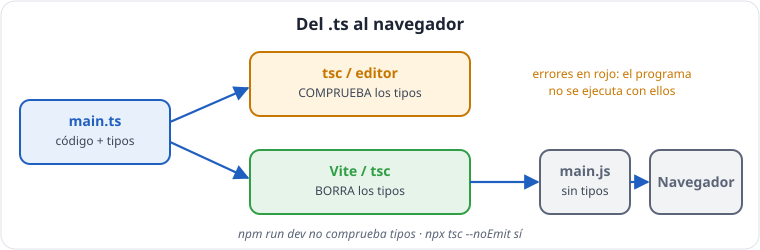

# Unidad 1 · TypeScript desde cero

*Apuntes de **Isaías FL** · Desarrollo Web en Entorno Cliente · 2.º DAW · Curso 2026‑27*

> **Qué vas a aprender:** qué es TypeScript y cómo se convierte en JavaScript; cómo crear y organizar un proyecto con Vite; los tipos básicos, la inferencia, las uniones, los objetos con `interface` y las funciones tipadas. Es la base de **todo** el curso y de React.

---

## Índice

1. [Qué es TypeScript](#1-qué-es-typescript)
2. [Del `.ts` al navegador: compilar](#2-del-ts-al-navegador-compilar)
3. [El proyecto Vite y su estructura](#3-el-proyecto-vite-y-su-estructura)
4. [Tipos básicos e inferencia](#4-tipos-básicos-e-inferencia) (con referencia de métodos de texto y número)
5. [Uniones y literales](#5-uniones-y-literales)
6. [`null`, `undefined` y valores por defecto](#6-null-undefined-y-valores-por-defecto)
7. [Arrays y tuplas](#7-arrays-y-tuplas)
8. [Objetos: `interface` y `type`](#8-objetos-interface-y-type)
9. [Funciones tipadas](#9-funciones-tipadas)
10. [Recorrer arrays](#10-recorrer-arrays)
11. [Los cuatro tipos especiales: `any`, `unknown`, `void`, `never`](#11-los-cuatro-tipos-especiales)
12. [Leer los errores del compilador](#12-leer-los-errores-del-compilador)
13. [Resumen y autoevaluación](#13-resumen-y-autoevaluación)

---

## 1. Qué es TypeScript

**TypeScript es JavaScript con un sistema de tipos.** Todo el JavaScript que sabes sigue siendo válido; TypeScript añade **anotaciones** que describen qué clase de valor es cada cosa, y un **compilador** que revisa el código **antes de ejecutarlo**.

```ts
let price = 10;
// precio = 'diez';   // MAL: Type 'string' is not assignable to type 'number'
```

Tres ideas que debes tener claras desde el primer día:

| Idea | Consecuencia |
|---|---|
| **Los tipos desaparecen al ejecutar.** El navegador recibe JavaScript normal. | Ningún tipo existe en ejecución. |
| **Por tanto, los tipos no validan datos.** | Lo que llega de un formulario, de `localStorage` o de una API hay que **comprobarlo con código**. |
| **TypeScript compara formas, no nombres** (*tipado estructural*). | Si un objeto tiene las propiedades que pide un tipo, es compatible, aunque nadie lo haya declarado así. |

> **Piensa en TypeScript como un corrector ortográfico:** subraya en rojo mientras escribes, pero no escribe por ti y no está presente cuando alguien lee el texto final.

---

## 2. Del `.ts` al navegador: compilar



El navegador **solo ejecuta JavaScript**. Un fichero `.ts` hay que **compilarlo**:

```bash
npm install -D typescript
npx tsc greeting.ts        # genera saludo.js
```

```ts
// greeting.ts (lo que escribes)
export function greet(name: string): string {
  return `Hola, ${name}`;
}
```

```js
// saludo.js (lo que genera tsc): el mismo código SIN tipos
export function greet(name) {
    return `Hola, ${name}`;
}
```

El compilador `tsc` hace **dos trabajos**:

1. **Comprobar** los tipos y mostrar errores.
2. **Emitir** JavaScript borrando los tipos.

> [!WARNING]
> **Atención:** `tsc` genera el `.js` **aunque haya errores de tipos**, salvo que actives la opción `noEmitOnError`. Un programa con errores de tipos puede «funcionar» y fallar más tarde.

### ¿Y con Vite?

Vite hace la traducción **al vuelo** mientras desarrollas, pero **no comprueba los tipos** en `npm run dev`. Quien comprueba es tu **editor** y el comando:

```bash
npx tsc --noEmit         # solo comprobar, sin generar ficheros
```

`npm run build` ejecuta primero `tsc` y después construye la versión final.

> [!IMPORTANT]
> **Regla del curso:** *si `npx tsc --noEmit` da errores, el ejercicio no está terminado.*

### ¿Y en Node?

Desde Node 22.18 (y en el Node 26 de clase), `node fichero.ts` ejecuta TypeScript directamente **borrando los tipos**, pero **sin comprobarlos**. Ejecutar y comprobar son dos pasos distintos.

---

## 3. El proyecto Vite y su estructura

```bash
npm create vite@latest tienda -- --template vanilla-ts
cd tienda
npm install
npm run dev
```

La estructura que usaremos durante todo el curso:

```
src/
├── main.ts              ← punto de entrada: importa y ejecuta
├── types/               ← interface / type
├── data/               ← datos de ejemplo
└── exercises/
    └── s01/ex01-prices-with-vat/index.ts   ← un ejercicio = una carpeta con export
```

Cada ejercicio **exporta** su función y `main.ts` la **importa**:

```ts
// (fragmento) src/exercises/s01/ex01-prices-with-vat/index.ts
export function pricesWithVat(prices: number[]): number[] {
  return prices.map((p) => p * 1.21);
}

// src/main.ts
import { pricesWithVat } from './exercises/s01/ex01-prices-with-vat';
console.log(pricesWithVat([10, 20]));
```

Al importar una **carpeta**, se carga su `index.ts`. En Vite las rutas van **sin extensión**.

### Lo más importante del `tsconfig.json` de Vite

| Opción | Significado |
|---|---|
| `"strict"` (activo por defecto en TS 6) | todas las comprobaciones estrictas |
| `"lib": ["ES2023", "DOM"]` | qué funciones del lenguaje y del navegador conoce |
| `"verbatimModuleSyntax": true` | obliga a escribir `import type` para importar solo tipos |
| `"erasableSyntaxOnly": true` | prohíbe sintaxis que no se pueda borrar, como `enum` |
| `"noUnusedLocals"` | error si declaras algo y no lo usas |

> **JavaScript moderno:** para usar las novedades de 2024–2025 que verás en estos apuntes (`Object.groupBy`, métodos de `Set`, `Promise.withResolvers`...), cambia en `tsconfig.json` la línea `"lib"` por `"lib": ["ES2025", "DOM", "DOM.Iterable"]`. Todos los navegadores actuales las soportan.

---

## 4. Tipos básicos e inferencia

```ts
const name = 'Isaías';  // tipo: 'Isaías'  (const no cambia: el tipo es ESE texto)
let city = 'Málaga';    // tipo: string    (let puede cambiar)
let grade = 7.5;           // tipo: number    (enteros y decimales)
let passed = true;      // tipo: boolean
let age: number;         // anotado: todavía no tiene valor
age = 20;
console.log(name, city, grade, passed, age);
```

Los dos puntos se leen **«es de tipo»**: `age: number` → *age es de tipo número*.

### Inferencia: TypeScript deduce

Si una variable tiene valor, TypeScript **deduce** su tipo. No hace falta escribirlo. En el editor, pon el cursor encima (en nvim, `K`) y lo verás.

**¿Cuándo hay que anotar?**

| Situación | Ejemplo |
|---|---|
| Parámetros de funciones | `function f(n: number)` |
| Retorno de funciones exportadas | `function f(): number[]` |
| Arrays vacíos | `const list: string[] = []` |
| Variables sin valor inicial | `let age: number;` |
| Cuando el valor inicial no muestra todas las posibilidades | <code>let selected: string &#124; null = null</code> |

> [!IMPORTANT]
> **Regla:** se anota en las **fronteras** (parámetros, retornos, datos que entran). Dentro, se deja inferir.

**Ejemplo comentado: qué deduce TypeScript en cada línea.** Pasa el ratón por cada variable en el editor y compruébalo:

```ts
const course = 'DWEC';            // tipo 'DWEC': con const, el tipo es ESE texto exacto
let teacher = 'Isaías FL';        // tipo string: con let, puede cambiar a otro texto
teacher = 'Lucía';                // correcto: sigue siendo un string
// teacher = 42;                  // error: Type 'number' is not assignable to type 'string'

const grades = [7, 8.5, 10];      // number[]: array de números
const mixed = [1, 'dos'];         // (string | number)[]: TS deduce la unión
const student = { name: 'Sara', age: 19 };   // { name: string; age: number }

console.log(course, teacher, grades, mixed, student);
```

### Tabla de tipos primitivos

| Tipo | Ejemplos | Ojo |
|---|---|---|
| `string` | `'hola'`, `` `Hola, ${name}` `` | |
| `number` | `5`, `3.14`, `NaN`, `Infinity` | **Atención:** `NaN` **es** un `number` |
| `boolean` | `true`, `false` | |
| `null` | `null` | vacío a propósito |
| `undefined` | `undefined` | nadie le ha dado valor |
| `bigint` | `10n` | enteros enormes (poco uso) |
| `symbol` | `Symbol('id')` | claves únicas (poco uso) |

> [!WARNING]
> **Atención:** Los tipos van en **minúscula**: `string`, no `String`.

### Referencia: métodos de texto (`string`)

Ningún método de `string` modifica el texto original (los textos son **inmutables**): todos **devuelven** uno nuevo.

| Método | Firma | Devuelve | Ejemplo → resultado |
|---|---|---|---|
| `length` | propiedad | `number`: número de unidades UTF-16 | `'Isaías'.length` → `6` |
| `at` | `text.at(index)` | el carácter en esa posición o `undefined`; admite negativos | `'Isaías'.at(-1)` → `'s'` |
| `slice` | `text.slice(start, end?)` | el trozo desde `start` hasta `end` (**sin incluir**); admite negativos | `'Isaías'.slice(1, 3)` → `'sa'` |
| `includes` | `text.includes(query, from?)` | `boolean` | `'Isaías'.includes('saí')` → `true` |
| `startsWith` / `endsWith` | `text.startsWith(query, position?)` | `boolean` | `'Isaías'.startsWith('Isa')` → `true` |
| `indexOf` | `text.indexOf(query, from?)` | posición o `-1` | `'Isaías'.indexOf('z')` → `-1` |
| `toUpperCase` / `toLowerCase` | `text.toUpperCase()` | el texto en mayúsculas/minúsculas | |
| `trim` / `trimStart` / `trimEnd` | `text.trim()` | sin espacios (ni saltos de línea) en los extremos | `'  Isaías FL  '.trim()` → `'Isaías FL'` |
| `split` | `text.split(separador, timeoutPromise?)` | `string[]` | `'a-b-c'.split('-')` → `['a', 'b', 'c']` |
| `replace` | `text.replace(pattern, replacer)` | con un texto como patrón, cambia **solo la primera** aparición | `'aXbX'.replace('X', '_')` → `'a_bX'` |
| `replaceAll` | `text.replaceAll(pattern, replacer)` | cambia **todas** (ES2021) | `'aXbX'.replaceAll('X', '_')` → `'a_b_'` |
| `padStart` / `padEnd` | `text.padStart(longitud, relleno = ' ')` | completa hasta la longitud | `'7'.padStart(3, '0')` → `'007'` |
| `repeat` | `text.repeat(times)` | el texto repetido | `'ab'.repeat(2)` → `'abab'` |
| `localeCompare` | `a.localeCompare(b, idioma?)` | negativo si `a` va antes, `0` si iguales, positivo si después | `'a'.localeCompare('b')` → `-1` |

### Referencia: números (`number`) y formato

| Función / método | Firma | Devuelve | Ojo |
|---|---|---|---|
| `Number` | `Number(value)` | el número o `NaN` | `Number('')` → `0`; `Number('3.5kg')` → `NaN` |
| `Number.parseFloat` | `Number.parseFloat(text)` | lee un decimal **desde el principio** | `Number.parseFloat('3.5kg')` → `3.5` (acepta basura al final) |
| `Number.parseInt` | `Number.parseInt(text, base)` | entero; indica siempre la base (`10`) | `Number.parseInt('08', 10)` → `8` |
| `Number.isNaN` | `Number.isNaN(value)` | `true` solo si es el valor `NaN` | ≠ `isNaN` global, que convierte antes: `isNaN('x')` → `true` |
| `Number.isFinite` / `Number.isInteger` | `Number.isFinite(value)` | `boolean`; no convierten | |
| `toFixed` | `n.toFixed(decimales)` | **`string`** redondeado | `(1.005).toFixed(2)` → `'1.00'` (los decimales binarios no son exactos) |
| `Math.round` / `floor` / `ceil` / `trunc` | `Math.round(n)` | entero | `Math.round(-2.5)` → `-2`; `Math.trunc(-2.7)` → `-2` |
| `Math.max` / `Math.min` | `Math.max(...numbers)` | el mayor / menor | `Math.max()` → `-Infinity` |

**Formatear para mostrar: `Intl`.** En lugar de concatenar `' €'`, usa la API de internacionalización del navegador:

```ts
const euros = new Intl.NumberFormat('es-ES', { style: 'currency', currency: 'EUR' });
console.log(euros.format(12345.5));   // '12.345,50 €'

const longDate = new Intl.DateTimeFormat('es-ES', { dateStyle: 'full' });
console.log(longDate.format(new Date(2026, 9, 6)));   // 'martes, 6 de octubre de 2026' (los meses empiezan en 0)
```

> [!NOTE]
> **Nota:** en español, `Intl` no pone separador de miles en los números de cuatro cifras (`1234,50 €`); sí a partir de cinco (`12.345,50 €`). Es la norma de la RAE.

---

## 5. Uniones y literales

La barra `|` significa **«o»**:

```ts
let code: string | number = 'A1';
code = 42; // BIEN: también vale
console.log(code);
```

Un **tipo literal** es un valor concreto usado como tipo. Unidos, forman una lista cerrada de opciones:

```ts
type Group = '2DAW-A' | '2DAW-B';
let group: Group = '2DAW-A';
// grupo = '2DAW-C';   // MAL: no está en la lista
console.log(group);
```

`type` crea un **alias**: un nombre para un tipo. No crea ningún valor.

> **En lugar de `enum`:** en los proyectos Vite actuales `enum` da error (`erasableSyntaxOnly`). Usa uniones de literales. Si además necesitas recorrer las opciones, declara un array `as const` y saca el tipo de él:

```ts
const GROUPS = ['2DAW-A', '2DAW-B'] as const;
type Group = (typeof GROUPS)[number];   // '2DAW-A' | '2DAW-B'

for (const g of GROUPS) {
  console.log(`Grupo de Isaías: ${g}`);
}
const myGroup: Group = '2DAW-B';
console.log(myGroup);
```

- `as const` → el array es de solo lectura y sus elementos son **literales**, no `string`.
- `(typeof GROUPS)[number]` → «el tipo de cualquier elemento del array»: la unión de sus valores.

---

## 6. `null`, `undefined` y valores por defecto

```ts
let selected: string | null = null;  // empieza vacío, luego tendrá un texto
selected = 'Lucía';

const email: string | undefined = undefined;
const show = email ?? 'sin email';    // ?? = "si no hay nada, usa esto"

const quantity = 0;
console.log(quantity || 10); // 10 (error) || trata el 0 como "vacío"
console.log(quantity ?? 10); // 0 (correcto) ?? solo actúa con null y undefined
console.log(selected, show);
```

| Operador | Usa el valor por defecto si el de la izquierda es... |
|---|---|
| <code>a &#124;&#124; b</code> | cualquier valor *falsy*: `false`, `0`, `''`, `NaN`, `null`, `undefined` |
| `a ?? b` | **solo** `null` o `undefined` |

### Encadenamiento opcional `?.` y asignación lógica `??=`

```ts
interface Ficha { name: string; tutor?: { name: string } }
const ficha: Ficha = { name: 'Marcos' };

console.log(ficha.tutor?.name);          // undefined, sin error
console.log(ficha.tutor?.name ?? 'Isaías'); // 'Isaías'

let attempts: number | undefined;
attempts ??= 3;   // solo asigna si era null/undefined
console.log(attempts); // 3
```

---

## 7. Arrays y tuplas

```ts
const grades: number[] = [8, 9, 7];           // "array de number"
const names: string[] = [];                // vacío: hay que anotar
const mixed: (string | number)[] = ['A', 1]; // paréntesis obligatorios
const fixed: readonly number[] = [1, 2];     // sin push, sort...
console.log(grades, names, mixed, fixed);
```

> [!WARNING]
> **Atención:** `string | number[]` (sin paréntesis) significa «un `string` **o** un array de números». No es lo mismo que `(string | number)[]`.

Una **tupla** es un array de longitud fija con un tipo por posición:

```ts
type Point = [number, number];
const origin: Point = [0, 0];
const [x, y] = origin;
console.log(x, y);
```

Las verás en React: `const [value, setValue] = useState(0)` devuelve una tupla.

> **Acceso por índice:** `grades[10]` tiene tipo `number` aunque no exista (vale `undefined` en ejecución). TypeScript no lo avisa con la configuración de Vite. Por eso usaremos `find`, `at` y comprobaciones.

---

## 8. Objetos: `interface` y `type`

```ts
type Group = '2DAW-A' | '2DAW-B';

interface Student {
  readonly id: number;   // no se puede reasignar
  name: string;
  group: Group;          // usa otro tipo nuestro
  grades: number[];       // un array dentro del objeto
  email?: string;        // ? = opcional → string | undefined
}

const lucia: Student = { id: 1, name: 'Lucía', group: '2DAW-A', grades: [8, 9, 7], email: 'lucia@ejemplo.es' };
const marcos: Student = { id: 2, name: 'Marcos', group: '2DAW-A', grades: [4, 5, 3] };
// lucia.id = 5;         // MAL: id es readonly
console.log(lucia, marcos);
```

- `interface Student { ... }` describe la **forma** de un objeto: qué propiedades tiene y de qué tipo.
- Las propiedades se separan con `;` o con saltos de línea, **no con comas**.
- `email?` → puede no estar. Al usarlo, TypeScript te obliga a contemplar que falte.
- `readonly` → protección **del compilador**; en ejecución el objeto se podría cambiar.

TypeScript detecta tres errores muy comunes:

```ts
// MAL: ERROR: ejemplos que NO compilan (a propósito)
const a: Student = { id: 3, name: 'Sara', grades: [] };                       // falta grupo
const b: Student = { id: 4, name: 'Iván', group: '2DAW-B', grades: [], emial: 'x' }; // errata
const c: Student = { id: 5, name: 'Ana', group: '2DAW-C', grades: [] };      // grupo inválido
```

### ¿`interface` o `type`?

| | `interface` | `type` |
|---|---|---|
| Describir objetos | Sí | Sí |
| Uniones (<code>'a' &#124; 'b'</code>) | No | Sí |
| Extender | `interface B extends A {}` | `type B = A & {}` |

> **Convención del curso:** `interface` para formas de objeto; `type` para uniones y alias. Las dos son correctas.

**Ejemplo comentado: las dos formas de extender.**

```ts
interface Person {
  name: string;
}

// Con interface: "extends" añade propiedades
interface Teacher extends Person {
  subject: string;
}

// Con type: la intersección "&" combina tipos
type Student = Person & { group: '2DAW-A' | '2DAW-B' };

const isaias: Teacher = { name: 'Isaías FL', subject: 'DWEC' };
const lucia: Student = { name: 'Lucía', group: '2DAW-A' };
console.log(isaias, lucia);
```

### Diccionarios con `Record`

```ts
type Grades = Record<string, number>;    // claves de texto → valores numéricos
const grades: Grades = { dwec: 8, dwes: 7 };
const grade = grades['diw'];              // en ejecución: undefined
console.log(grade ?? 'sin nota');
```

---

## 9. Funciones tipadas

```ts
function greet(name: string, greeting = 'Hola', signature?: string): string {
  const end = signature === undefined ? '' : ` — ${signature}`;
  return `${greeting}, ${name}${end}`;
}

console.log(greet('Lucía'));                         // 'Hola, Lucía'
console.log(greet('Lucía', 'Buenos días', 'Isaías')); // 'Buenos días, Lucía — Isaías'
```

| Parte | Significado |
|---|---|
| `name: string` | parámetro **obligatorio** |
| `greeting = 'Hola'` | con **valor por defecto** (opcional al llamar) |
| `signature?: string` | **opcional**: dentro vale <code>string &#124; undefined</code> |
| `): string` | **tipo de retorno**: promete devolver un `string` |

Los parámetros opcionales van **al final**. Las funciones flecha se tipan igual:

```ts
const double = (n: number): number => n * 2;
console.log(double(21));
```

### `void`: funciones que no devuelven nada útil

```ts
function show(message: string): void {
  console.log(message);
}
show('Bienvenidos a DWEC');
```

> **No confundas mostrar con devolver.** Una función que hace `console.log` no **devuelve** nada: `const x = show('hola')` vale `undefined`.

### Devolver «puede que no haya resultado»: `number | null`

```ts
function media(grades: number[]): number | null {
  if (grades.length === 0) {
    return null;          // sin notas no hay media (dividir entre 0 daría NaN)
  }
  let sum = 0;
  for (const n of grades) {
    sum += n;
  }
  return sum / grades.length;
}

const m = media([]);
console.log(m === null ? 'sin notas' : m.toFixed(2));
```

¿Por qué no devolver `0`? Porque `0` es una nota real. `null` dice «no existe» y su tipo **obliga** a quien llama a tratarlo.

### Retorno temprano (*guard clause*)

Primero se descartan los casos malos con `return`; después viene el camino feliz, sin anidar. Lo usarás en todo el curso.

**Ejemplo comentado: la misma función, anidada y con retorno temprano.**

```ts
// Anidada: cuesta seguir los caminos
function finalGradeNested(grades: number[]): string {
  if (grades.length > 0) {
    const avg = grades.reduce((s, g) => s + g, 0) / grades.length;
    if (avg >= 5) {
      return `Aprobado (${avg.toFixed(1)})`;
    } else {
      return `Suspenso (${avg.toFixed(1)})`;
    }
  } else {
    return 'Sin notas';
  }
}

// Con retorno temprano: primero se descartan los casos especiales
function finalGrade(grades: number[]): string {
  if (grades.length === 0) return 'Sin notas';          // 1. caso especial, fuera
  const avg = grades.reduce((s, g) => s + g, 0) / grades.length;
  if (avg < 5) return `Suspenso (${avg.toFixed(1)})`;   // 2. otro caso, fuera
  return `Aprobado (${avg.toFixed(1)})`;                // 3. el camino feliz, sin anidar
}

console.log(finalGradeNested([4, 6]), finalGrade([]), finalGrade([8, 9]));
```

---

## 10. Recorrer arrays

```ts
const students = [
  { name: 'Lucía', grade: 8.5 },
  { name: 'Marcos', grade: 4 },
];

// for clásico: cuando necesitas el índice
for (let i = 0; i < students.length; i++) {
  console.log(i, students[i].name);
}

// for...of: cuando necesitas los valores (el más legible)
for (const a of students) {
  console.log(a.name);              // a: { nombre: string; nota: number }
}

// forEach: ejecutar algo por cada elemento
students.forEach((a, i) => console.log(i, a.name));

// entries(): valor e índice con for...of
for (const [i, a] of students.entries()) {
  console.log(`${i + 1}. ${a.name}`);
}
```

> [!WARNING]
> **Errores típicos:**
>
> - `for...in` sobre arrays recorre las **claves como texto** (`'0'`, `'1'`...). Para arrays, **nunca**.
> - `return` dentro de `forEach` **no** sale de la función: solo salta ese elemento. Para buscar y salir, `for...of` con `return` (o `find`, en la unidad 2).
> - `forEach` devuelve `undefined`. Si quieres **construir** un resultado, la unidad 2 te da herramientas mejores.

---

## 11. Los cuatro tipos especiales

| Tipo | Significado | Cuándo |
|---|---|---|
| `any` | «no compruebes nada» | **Nunca** en este curso |
| `unknown` | «no sé qué es; compruébalo antes de usarlo» | datos externos (`JSON.parse`, APIs, `catch`) |
| `void` | la función no devuelve nada útil | funciones que muestran o pintan |
| `never` | «esto no puede ocurrir» | `switch` exhaustivos (unidad 4) |

```ts
function describe(raw: unknown): string {
  if (typeof raw === 'string') return `Texto: ${raw}`;     // aquí dato es string
  if (typeof raw === 'number') return `Número: ${raw}`;    // aquí dato es number
  return 'Otra cosa';
}
console.log(describe('Isaías'), describe(42), describe([1]));
```

> [!IMPORTANT]
> **Clave:** *`any` apaga TypeScript. `unknown` te obliga a comprobar.*

---

## 12. Leer los errores del compilador

| Mensaje | Qué quiere decir |
|---|---|
| `Type 'string' is not assignable to type 'number'` | pones un texto donde se espera un número |
| `'x' is possibly 'undefined'` | puede no haber valor: compruébalo |
| `Property 'x' does not exist on type 'Y'` | errata o tipo equivocado |
| `Parameter 'x' implicitly has an 'any' type` | falta el tipo del parámetro |
| `Property 'x' is missing in type ... but required in type 'Y'` | falta una propiedad obligatoria |
| `Object literal may only specify known properties` | propiedad de más (¿errata?) |
| `'x' is declared but its value is never read` | variable sin usar |
| `... must be imported using a type-only import` | falta `import type` |

> [!TIP]
> **Consejo:** En un error largo, lee **primero la última línea**: es la más concreta.

**Ejemplo comentado: un error real y cómo leerlo.**

```ts
// MAL: este código NO compila (a propósito)
interface Product { id: number; name: string; price: number }

const webcam: Product = { id: 7, name: 'Webcam de Isaías', price: '50' };
//                                                          ~~~~~
// error TS2322: Type 'string' is not assignable to type 'number'.
//   The expected type comes from property 'price' which is declared here on type 'Product'
```

Cómo leerlo, paso a paso:

1. **Dónde:** la línea y la columna (el editor subraya `price`).
2. **Qué:** «un `string` no se puede asignar a un `number`».
3. **Por qué:** la segunda línea dice de dónde viene la exigencia: la propiedad `price` del tipo `Product`.
4. **Arreglo:** escribir `price: 50`. Si el dato viene de un formulario, convertirlo con `Number(...)` y validarlo (unidad 6).

---

## 13. Resumen y autoevaluación

**Resumen en 8 frases:**

1. TypeScript es JavaScript con tipos que se comprueban antes de ejecutar y desaparecen después.
2. El navegador ejecuta el `.js`; Vite traduce al vuelo, `tsc` comprueba.
3. Se anota en las fronteras; dentro se deja inferir.
4. `|` une posibilidades; las uniones de literales sustituyen a `enum`.
5. `??` para valores por defecto; `?.` para acceder sin romper.
6. `interface` describe objetos; `?` opcional, `readonly` protegido.
7. Una función promete su tipo de retorno; `number | null` obliga a comprobar.
8. `unknown` sí, `any` nunca.

**¿Lo sabes?**

- [ ] ¿Qué tipo infiere TypeScript para `const x = 'hola'` y para `let y = 'hola'`?
- [ ] ¿Por qué hay que anotar `const list: string[] = []`?
- [ ] ¿Qué diferencia hay entre `quantity || 10` y `quantity ?? 10` si `quantity` vale `0`?
- [ ] Escribe una `interface Book` con `title`, `author`, `pages` e `isbn` opcional.
- [ ] ¿Por qué `media([])` devuelve `null` y no `0`?
- [ ] ¿Qué recorre `for...in` en un array?
