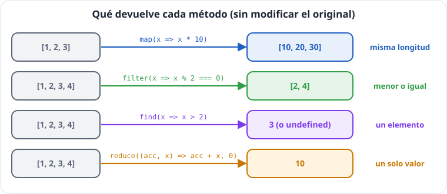
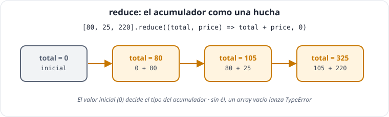

# Unidad 2 · Arrays funcionales: transformar, buscar, reducir y ordenar

*Apuntes de **Isaías FL** · Desarrollo Web en Entorno Cliente · 2.º DAW · Curso 2026‑27*

> **Qué vas a aprender:** a trabajar con arrays **sin bucles y sin modificar el original**: `map`, `filter`, `find`, `some`, `every`, `reduce`, `toSorted` y las novedades de 2023–2025 (`at`, `findLast`, `with`, `Object.groupBy`...). En React, **todas** las listas se pintan con `map` y se calculan con estas funciones.

---

## Índice

1. [Los datos de la unidad: TechStore Isaías FL](#1-los-datos-de-la-unidad-techstore-isaías-fl)
2. [Las tres preguntas de cualquier método](#2-las-tres-preguntas-de-cualquier-método)
3. [`map`: transformar](#3-map-transformar)
4. [`filter`: seleccionar](#4-filter-seleccionar)
5. [Buscar: `find`, `findIndex`, `findLast`, `at`](#5-buscar-find-findindex-findlast-at)
6. [Comprobar: `some`, `every`, `includes`](#6-comprobar-some-every-includes)
7. [`reduce`: resumir en un valor](#7-reduce-resumir-en-un-valor)
8. [Ordenar sin romper: `toSorted` y compañía](#8-ordenar-sin-romper-tosorted-y-compañía)
9. [Encadenar métodos](#9-encadenar-métodos)
10. [Más herramientas: `flat`, `flatMap`, `Array.from`, `Object.groupBy`](#10-más-herramientas)
11. [Tabla resumen](#11-tabla-resumen)
12. [Autoevaluación](#12-autoevaluación)

---

## 1. Los datos de la unidad: TechStore Isaías FL

Durante el curso programaremos la tienda de tu profesor, **TechStore Isaías FL**. Empieza siendo un array y terminará siendo una aplicación React.

```ts
// sin-preludio
// src/types/product.ts
export type Category = 'peripherals' | 'monitors' | 'audio';

export interface Product {
  readonly id: number;
  name: string;
  price: number;      // euros, sin IVA
  category: Category;
  stock: number;
}

// src/data/products.ts
export const products: Product[] = [
  { id: 1, name: 'Teclado mecánico', price: 80, category: 'peripherals', stock: 5 },
  { id: 2, name: 'Ratón inalámbrico', price: 25, category: 'peripherals', stock: 0 },
  { id: 3, name: 'Monitor 27"', price: 220, category: 'monitors', stock: 3 },
  { id: 4, name: 'Auriculares', price: 60, category: 'audio', stock: 10 },
  { id: 5, name: 'Monitor 24"', price: 140, category: 'monitors', stock: 0 },
  { id: 6, name: 'Micrófono USB', price: 45, category: 'audio', stock: 2 },
];
```

---

## 2. Las tres preguntas de cualquier método



**Los parámetros del callback.** Casi todos los métodos de esta unidad reciben una función (el *callback*) y la llaman **una vez por elemento** con **tres argumentos**, en este orden:

| Posición | Nombre habitual | Tipo | Qué es |
|---|---|---|---|
| 1.º | `element` (o `p`, `x`...) | `T` | el elemento actual |
| 2.º | `index` | `number` | su posición (empieza en 0) |
| 3.º | `array` | `T[]` | el array completo que se está recorriendo |

Solo se declaran los que se usan: `(p) => ...`, `(p, i) => ...`. Además aceptan un segundo argumento opcional, `thisArg`, que fija el `this` del callback; con funciones flecha no se usa nunca. La excepción es `reduce`, cuyo callback recibe **cuatro** argumentos (apartado 7).

**Ficha técnica · `forEach`**

| | |
|---|---|
| **Firma** | `list.forEach(callback, thisArg?)` |
| **Callback** | `(element: T, index: number, array: T[]) => void` |
| **Devuelve** | `undefined` (siempre) |
| **¿Muta el array?** | No (aunque el callback podría hacerlo) |
| **¿Se puede detener?** | No: ni `break` ni `return` lo paran (`return` solo salta a la siguiente vuelta) |
| **Desde** | ES5 (2009) |

Para entender **cualquier** método de array, hazte siempre estas tres preguntas:

1. ¿Qué **pregunta** le hace a cada elemento? (la función que le pasas, el *callback*)
2. ¿Qué **devuelve**? (y de qué tipo)
3. ¿**Modifica** el array original?

Primero, el método que ya conoces:

```ts
const prices = [10, 20, 30];
const doubles = prices.forEach((p) => p * 2);
console.log(doubles); // undefined
```

`forEach` sirve para **hacer algo** con cada elemento (mostrar, enviar...), pero **no construye nada**: devuelve `undefined`. Para obtener resultados, los métodos de esta unidad.

---

## 3. `map`: transformar

**Ficha técnica · `map`**

| | |
|---|---|
| **Firma** | `list.map(callback, thisArg?)` |
| **Callback** | `(element: T, index: number, array: T[]) => U` |
| **Devuelve** | `U[]`: un array **nuevo** con lo que devolvió el callback para cada elemento |
| **Longitud del resultado** | **igual** a la del original |
| **¿Muta el array?** | No |
| **Array vacío** | devuelve `[]` sin llamar al callback |
| **Desde** | ES5 (2009) |

**Uno entra, uno sale.** `map` aplica una función a cada elemento y construye un array **nuevo de la misma longitud** con los resultados.

```
[ 1, 2, 3 ]  ──map(x => x * 10)──▶  [ 10, 20, 30 ]
```

```ts
const names = products.map((p) => p.name);
// string[] → ['Teclado mecánico', 'Ratón inalámbrico', ...]

const VAT = 0.21;
const withVat = products.map((p) => Math.round(p.price * (1 + VAT) * 100) / 100);
// number[] → [96.8, 30.25, 266.2, 72.6, 169.4, 54.45]

// map recibe también el índice
const numbered = products.map((p, i) => `${i + 1}. ${p.name}`);
console.log(names, withVat, numbered);
```

No hace falta tipar `p`: TypeScript sabe que `products` es `Product[]`, así que `p` es `Product` (*tipado contextual*).

### El error número 1: llaves sin `return`

```ts
// MAL: Con llaves hay que escribir return: esto da [undefined, undefined, ...]
const bad = products.map((p) => { p.name });
```

```ts
const good1 = products.map((p) => p.name);           // sin llaves: return implícito
const good2 = products.map((p) => {
  return p.name;                                      // con llaves: return explícito
});
// Para devolver un OBJETO sin llaves, envuélvelo en paréntesis
const fichas = products.map((p) => ({ id: p.id, text: p.name }));
console.log(good1, good2, fichas);
```

> **Si abres llave, escribe `return`.**

---

## 4. `filter`: seleccionar

**Ficha técnica · `filter`**

| | |
|---|---|
| **Firma** | `list.filter(predicate, thisArg?)` |
| **Predicado** | `(element: T, index: number, array: T[]) => unknown`: se evalúa como *truthy* o *falsy* |
| **Devuelve** | `T[]`: array **nuevo** con los elementos cuyo predicado fue *truthy* (los **mismos** objetos, no copias) |
| **Longitud del resultado** | de `0` a la del original |
| **¿Muta el array?** | No |
| **Con un type guard** | si el predicado es `(x): x is S => ...`, devuelve `S[]` |
| **Desde** | ES5 (2009) |

`filter` hace a cada elemento una pregunta de **sí o no**. Los que responden *sí* pasan al array nuevo.

```ts
const available = products.filter((p) => p.stock > 0);
console.log(available.length); // 4
console.log(products.length);   // 6 → el original no cambia

const cheap = products.filter((p) => p.price <= 60);
const empty = products.filter((p) => p.price > 1000);   // [] (sin error)
console.log(cheap, empty);
```

| | Entrada | Salida | Longitud |
|---|---|---|---|
| `map` | `Product[]` | lo que devuelva el callback | **igual** |
| `filter` | `Product[]` | `Product[]` (los mismos elementos) | **menor o igual** |

### Filtrar los `null`

Un truco moderno muy usado: transformar con `map` y quitar los resultados vacíos con `filter`.

```ts
function discountedPrice(p: Product): number | null {
  return p.stock > 0 ? p.price * 0.9 : null;
}
const discounted = products.map(discountedPrice).filter((x) => x !== null);
// tipo: number[] (desde TypeScript 5.5 TS deduce que ya no hay null)
console.log(discounted);
```

---

## 5. Buscar: `find`, `findIndex`, `findLast`, `at`

### `find`: el primero que cumpla... o nada

**Ficha técnica · `find`**

| | |
|---|---|
| **Firma** | `list.find(predicate, thisArg?)` |
| **Predicado** | `(element: T, index: number, array: T[]) => unknown` |
| **Devuelve** | el **primer** elemento cuyo predicado es *truthy*, o `undefined` si ninguno lo cumple. Tipo: <code>T &#124; undefined</code> |
| **¿Se detiene?** | Sí, en cuanto encuentra el primero (no recorre el resto) |
| **¿Muta el array?** | No |
| **Array vacío** | `undefined` |
| **Desde** | ES2015 |

```ts
const monitor = products.find((p) => p.id === 3);
// tipo: Product | undefined
```

TypeScript te avisa de que **puede no encontrarlo**. No puedes usar `monitor.name` directamente: hay que **comprobar**.

```ts
function describeProduct(list: Product[], id: number): string {
  const product = list.find((p) => p.id === id);
  if (product === undefined) {
    return `No existe el producto ${id}`;
  }
  // Aquí TypeScript ya sabe que producto es Product (narrowing)
  return `${product.name}: ${product.price} €`;
}
console.log(describeProduct(products, 3));  // 'Monitor 27": 220 €'
console.log(describeProduct(products, 99)); // 'No existe el producto 99'
```

Esto se llama **narrowing** (estrechamiento): tras la comprobación, TypeScript **reduce** el tipo de `Product | undefined` a `Product`.

```
Producto | undefined ──¿=== undefined?──┬── sí ──▶ return temprano
                                        └── no ──▶ Producto (correcto)
```

> **No calles al compilador.** `product!.name` o `(product as Product).name` compilan, pero si no existe **revientan igual**. `!` y `as` son **afirmaciones**, no **comprobaciones**.


### `findIndex`: la posición... o `-1`

**Ficha técnica · `findIndex`**

| | |
|---|---|
| **Firma** | `list.findIndex(predicate, thisArg?)` |
| **Predicado** | `(element: T, index: number, array: T[]) => unknown` |
| **Devuelve** | `number`: la posición del **primer** elemento que cumple, o **`-1`** si ninguno |
| **¿Se detiene?** | Sí, en el primero |
| **¿Muta el array?** | No |
| **Desde** | ES2015 |

```ts
const position = products.findIndex((p) => p.id === 99);
if (position === -1) {
  console.log('No está');
}
```

> [!WARNING]
> **Atención:** `if (position)` es una trampa: la posición `0` es *falsy* y el `-1` es *truthy*. Compara siempre con `=== -1`.

### `findLast`, `findLastIndex` y `at`

**Ficha técnica · `findLast` / `findLastIndex` / `at`**

| Método | Firma | Devuelve | Desde |
|---|---|---|---|
| `findLast` | `list.findLast(predicate, thisArg?)` | el **último** elemento que cumple, o `undefined` (recorre desde el final) | ES2023 |
| `findLastIndex` | `list.findLastIndex(predicate, thisArg?)` | la posición del **último** que cumple, o `-1` | ES2023 |
| `at` | `list.at(index: number)` | el elemento en esa posición, o `undefined`; los **negativos** cuentan desde el final (`-1` = último). Tipo: <code>T &#124; undefined</code> | ES2022 |

Ninguno muta el array.

```ts
const lastSoldOut = products.findLast((p) => p.stock === 0);  // Monitor 24"
const last = products.at(-1);        // el último elemento: Product | undefined
const secondToLast = products.at(-2);
console.log(lastSoldOut?.name, last?.name, secondToLast?.name);
```

`at(-1)` sustituye al antiguo `list[list.length - 1]`, y además su tipo **sí** incluye `undefined`: es más honesto que el acceso por índice.

---

## 6. Comprobar: `some`, `every`, `includes`

**Ficha técnica · `some` / `every` / `includes` / `indexOf`**

| Método | Firma | Devuelve | Se detiene | Array vacío |
|---|---|---|---|---|
| `some` | `list.some(predicate, thisArg?)` | `true` si **al menos uno** cumple | en el primer `true` | `false` |
| `every` | `list.every(predicate, thisArg?)` | `true` si **todos** cumplen | en el primer `false` | **`true`** |
| `includes` | `list.includes(value, from?)` | `true` si el **valor** está | al encontrarlo | `false` |
| `indexOf` | `list.indexOf(value, from?)` | la posición del valor, o `-1` | al encontrarlo | `-1` |

- El predicado de `some` y `every` recibe `(element, index, array)`, como en `find`.
- `from` (opcional) es la posición en la que empezar a buscar.
- **Comparación:** `includes` usa la igualdad *SameValueZero* (encuentra `NaN`); `indexOf` usa `===` (**no** encuentra `NaN`). Los objetos se comparan **por referencia**: `[{ id: 1 }].includes({ id: 1 })` es `false`.
- Ninguno muta el array. `some`/`every`: ES5; `includes`: ES2016.

```ts
const hasSoldOut = products.some((p) => p.stock === 0);     // ¿al menos uno?  true
const allValid = products.every((p) => p.price > 0);    // ¿todos?         true
const hasAudio = products.map((p) => p.category).includes('audio'); // ¿está este valor? true
console.log(hasSoldOut, allValid, hasAudio);
```

> **La «verdad vacía»:** en un array vacío, `some` da `false` y **`every` da `true`** (nadie incumple la regla). Una tienda sin productos «tiene todos sus productos con stock». Ten en cuenta el vacío.

`includes` compara **valores**, no condiciones: para buscar un objeto por `id` usa `some((p) => p.id === 3)`.

---

## 7. `reduce`: resumir en un valor



**Ficha técnica · `reduce`**

| | |
|---|---|
| **Firma** | `list.reduce(callback, initialValue?)` |
| **Callback** | `(accumulator: A, element: T, index: number, array: T[]) => A` (**cuatro** parámetros) |
| **Devuelve** | el valor final del acumulador (tipo `A`, el del valor inicial) |
| **Con `initialValue`** | la primera vuelta recibe `accumulator = initialValue` y empieza en el índice 0 |
| **Sin `initialValue`** | usa el **primer elemento** como acumulador y empieza en el índice 1 |
| **Array vacío sin `initialValue`** | lanza `TypeError: Reduce of empty array with no initial value` |
| **¿Muta el array?** | No |
| **Variante** | `reduceRight`: igual, pero recorre de derecha a izquierda |
| **Desde** | ES5 (2009) |

`reduce` convierte un array en **un solo valor**: un total, un máximo, un objeto con contadores... Funciona como una **hucha**: empieza con un valor inicial y en cada vuelta echas algo.

```
productos:   [ 80€×5 , 25€×0 , 220€×3 , ... ]
acumulador:    0 → 400 → 400 → 1060 → ... → 1750
               ↑ valor inicial
```

```ts
const inventoryValue = products.reduce((total, p) => total + p.price * p.stock, 0);
console.log(inventoryValue); // 1750
```

- `total` → el **acumulador**. En la primera vuelta vale el valor inicial.
- `p` → el elemento actual.
- Lo que devuelve el callback es el **nuevo** valor del acumulador.
- `0` → el **valor inicial**, al final.

> **Siempre con valor inicial.** El valor inicial **decide el tipo** del acumulador. Sin él, con un array vacío, `reduce` **lanza un error en ejecución** que TypeScript no detecta.

### Acumular en un objeto

```ts
const initial: Record<Category, number> = { peripherals: 0, monitors: 0, audio: 0 };
const units = products.reduce(
  (acc, p) => ({ ...acc, [p.category]: acc[p.category] + p.stock }),
  initial,
);
console.log(units); // { perifericos: 5, monitores: 3, audio: 12 }
```

- `Record<Category, number>` → un objeto con **las tres** categorías como claves y números como valores. Si olvidas una, error.
- `[p.category]: ...` → **clave calculada**: usa el valor de la variable como nombre de propiedad.

### Media con `reduce` y control del vacío

```ts
function averagePrice(list: Product[]): number | null {
  if (list.length === 0) return null;
  return list.reduce((sum, p) => sum + p.price, 0) / list.length;
}
console.log(averagePrice(products), averagePrice([]));
```

> [!TIP]
> **Consejo:** Si un `reduce` se vuelve ilegible, un `for...of` sobre una variable **local** es perfectamente correcto. La legibilidad manda.

---

## 8. Ordenar sin romper: `toSorted` y compañía

**Ficha técnica · ordenar y modificar posiciones**

| Método | Firma | Devuelve | ¿Muta? | Desde |
|---|---|---|---|---|
| `sort` | `list.sort(comparator?)` | **el mismo** array, ordenado | **Sí** | ES1 |
| `toSorted` | `list.toSorted(comparator?)` | un array **nuevo** ordenado | No | ES2023 |
| `reverse` | `list.reverse()` | **el mismo** array, invertido | **Sí** | ES1 |
| `toReversed` | `list.toReversed()` | un array **nuevo** invertido | No | ES2023 |
| `splice` | `list.splice(start, howMany?, ...newItems)` | un array con los elementos **eliminados** | **Sí** | ES3 |
| `toSpliced` | `list.toSpliced(start, howMany?, ...newItems)` | un array **nuevo** con los cambios | No | ES2023 |
| `with` | `list.with(index, value)` | un array **nuevo** con esa posición cambiada; `RangeError` si el índice no existe | No | ES2023 |

- **Comparador:** `(a: T, b: T) => number`. Negativo: `a` antes; positivo: `a` después; `0`: mantienen su orden (la ordenación es **estable** desde ES2019).
- **Sin comparador** convierte los elementos a **texto** y los ordena por su código Unicode: `[10, 9, 1]` queda `[1, 10, 9]`.

```ts
const numbers = [80, 25, 220];
const sorted = numbers.sort((a, b) => a - b);
console.log(numbers);   // [25, 80, 220] ← ¡sort ha MODIFICADO el original!
console.log(sorted === numbers); // true: es el mismo array
```

`sort` es antiguo y **muta**. **Novedad:** Desde ES2023 existen versiones que **devuelven una copia**:

| Muta (evitar) | No muta (usar) |
|---|---|
| `sort(fn)` | `toSorted(fn)` |
| `reverse()` | `toReversed()` |
| `splice(i, n, ...)` | `toSpliced(i, n, ...)` |
| `list[i] = x` | `list.with(i, x)` |

```ts
const byPrice = products.toSorted((a, b) => a.price - b.price);       // ascendente
const mostExpensive = products.toSorted((a, b) => b.price - a.price);        // descendente
const byName = products.toSorted((a, b) => a.name.localeCompare(b.name, 'es'));
const reversed = products.toReversed();
const changed = [10, 20, 30].with(1, 99);   // [10, 99, 30]
console.log(byPrice[0].name, mostExpensive[0].name, byName[0].name, reversed[0].name, changed);
```

### La función comparadora

| Si devuelve | Significa |
|---|---|
| negativo | `a` va **antes** que `b` |
| positivo | `a` va **después** |
| `0` | da igual (empate) |

> [!IMPORTANT]
> **Clave:** `a - b` → ascendente; `b - a` → descendente.
> **Atención:** `[10, 9, 1].toSorted()` **sin comparador** da `[1, 10, 9]`: ordena como **texto**.
> **Consejo:** `localeCompare(other, 'es')` ordena bien tildes y eñes.

**Ejemplo comentado: qué hace `toSorted` con el comparador.**

```ts
const prices = [80, 25, 220];

const ascending = prices.toSorted((a, b) => {
  // toSorted llama a esta función con parejas de elementos.
  // Ejemplo: a = 80, b = 25 → 80 - 25 = 55 (positivo) → 80 va DESPUÉS de 25
  return a - b;
});

const descending = prices.toSorted((a, b) => b - a);   // al revés: b - a

console.log(ascending);    // [25, 80, 220]
console.log(descending);   // [220, 80, 25]
console.log(prices);       // [80, 25, 220]  ← el original no cambia
```

### Ordenar por varios criterios

```ts
const byCategoryAndPrice = products.toSorted(
  (a, b) => a.category.localeCompare(b.category) || a.price - b.price,
);
console.log(byCategoryAndPrice.map((p) => `${p.category} · ${p.name}`));
```

Si la categoría empata (`0`), `||` pasa al segundo criterio. Es de los pocos casos donde `||` es la herramienta correcta.

---

## 9. Encadenar métodos

Cada método recibe el resultado del anterior. Escribe **uno por línea** y léelo como una frase:

```ts
const top3 = products
  .filter((p) => p.stock > 0)                  // 1. solo disponibles
  .toSorted((a, b) => b.price - a.price)     // 2. de más caro a más barato
  .slice(0, 3)                                 // 3. los tres primeros (slice no muta)
  .map((p) => `${p.name} (${p.price} €)`);  // 4. a texto
console.log(top3);
// ['Monitor 27" (220 €)', 'Teclado mecánico (80 €)', 'Auriculares (60 €)']
```

> *«De los productos, quédate con los disponibles, ordénalos de más caro a más barato, toma tres y dame su texto.»*

> **El orden importa.** Si haces `map` primero, ya solo tienes textos y no puedes filtrar por `stock`. Y filtrar **antes** de ordenar es más rápido (se ordenan menos elementos).

---

## 10. Más herramientas

### `flat` y `flatMap`

**Ficha técnica · `flat` / `flatMap`**

| Método | Firma | Devuelve | Desde |
|---|---|---|---|
| `flat` | `list.flat(profundidad = 1)` | array **nuevo** con los subarrays aplanados hasta esa profundidad (`Infinity` = todos) | ES2019 |
| `flatMap` | `list.flatMap(callback, thisArg?)` | como `map` seguido de `flat(1)`: el callback `(element, index, array)` devuelve un valor o un array | ES2019 |

```ts
const byBox = [[1, 2], [3], [4, 5]];
console.log(byBox.flat());             // [1, 2, 3, 4, 5]

const tags = products.flatMap((p) => (p.stock === 0 ? ['soldOut'] : [p.category]));
console.log(tags);
```

`flatMap` = `map` + `flat`: cada elemento puede producir **cero, uno o varios** resultados.

### `Array.from` y `Array.of`

**Ficha técnica · `Array.from` / `Array.of` / `Array.isArray`**

| Método | Firma | Devuelve |
|---|---|---|
| `Array.from` | `Array.from(origin, mapFn?, thisArg?)` | array **nuevo** a partir de un iterable (`Set`, `Map`, `string`, `NodeList`...) o de un objeto con `length`; `mapFn(value, index)` transforma cada elemento |
| `Array.of` | `Array.of(...items)` | array con esos elementos (`Array.of(3)` es `[3]`, mientras que `new Array(3)` crea 3 huecos vacíos) |
| `Array.isArray` | `Array.isArray(value)` | `true` si es un array (sirve de *narrowing* con `unknown`) |

```ts
const five = Array.from({ length: 5 }, (_, i) => i + 1);   // [1, 2, 3, 4, 5]
const letters = Array.from('Isaías');                       // ['I','s','a','í','a','s']
console.log(five, letters);
```

### `Object.groupBy` (ES2024)

**Ficha técnica · `Object.groupBy` / `Map.groupBy`**

| | |
|---|---|
| **Firma** | `Object.groupBy(items, key)` · `Map.groupBy(items, key)` |
| **`items`** | cualquier **iterable** (array, `Set`...) |
| **`key`** | `(element: T, index: number) => K`: la clave de grupo de cada elemento |
| **Devuelve** | `Object.groupBy`: un objeto *sin prototipo* `{ key: T[] }`, de tipo `Partial<Record<K, T[]>>` (cada grupo puede faltar). `Map.groupBy`: un `Map<K, T[]>` (la clave puede ser de cualquier tipo) |
| **¿Muta?** | No |
| **Desde** | ES2024 (requiere `lib: ES2025` en el `tsconfig`) |

Agrupa los elementos según una clave, en una línea:

```ts
const byCategory = Object.groupBy(products, (p) => p.category);
// { perifericos: [...], monitores: [...], audio: [...] }
console.log(byCategory.audio?.map((p) => p.name));
```

> [!NOTE]
> **Nota:** Requiere `"lib": ["ES2025", "DOM", "DOM.Iterable"]` en el `tsconfig.json` (ver unidad 1). Cada grupo puede ser `undefined` (si no hay elementos de esa clave), por eso el `?.`.

### Iteradores con métodos (ES2025)

**Ficha técnica · métodos de iterador (ES2025)**

| Método | Qué hace |
|---|---|
| `iter.map(fn)` / `iter.filter(fn)` | como los de array, pero **perezosos**: no calculan nada hasta que se pide |
| `iter.take(n)` / `iter.drop(n)` | se queda con los `n` primeros / se salta los `n` primeros |
| `iter.flatMap(fn)` | como el de array |
| `iter.toArray()` | consume el iterador y devuelve un array |
| `iter.some` / `every` / `find` / `reduce` / `forEach` | como los de array; consumen el iterador |

Se obtiene un iterador con `list.values()`, `list.keys()`, `list.entries()`, o de un `Map`/`Set`. El callback recibe `(value, counter)`. Un iterador **solo se puede recorrer una vez**.

Los iteradores (`values()`, `keys()`, `entries()`...) ahora tienen `map`, `filter`, `take`... que trabajan **bajo demanda**, sin crear arrays intermedios:

```ts
const firstNames = products
  .values()
  .filter((p) => p.stock > 0)
  .map((p) => p.name)
  .take(2)
  .toArray();
console.log(firstNames); // ['Teclado mecánico', 'Monitor 27"']
```

Útil con colecciones grandes: se detiene en cuanto tiene los dos que pide `take`.

---

## 11. Tabla resumen

| Método | Pregunta al elemento | Devuelve | ¿Muta? |
|---|---|---|---|
| `forEach` | haz algo | `undefined` | no |
| `map` | ¿en qué te conviertes? | array, **misma longitud** | no |
| `filter` | ¿te quedas? | array, **≤ longitud** | no |
| `find` / `findLast` | ¿eres tú? | elemento o `undefined` | no |
| `findIndex` | ¿eres tú? | posición o `-1` | no |
| `at(i)` | — | elemento o `undefined` (admite negativos) | no |
| `some` | ¿alguno cumple? | `boolean` | no |
| `every` | ¿todos cumplen? | `boolean` (vacío → `true`) | no |
| `includes` | ¿está este valor? | `boolean` | no |
| `reduce` | ¿cómo acumulo? | un valor (del tipo del inicial) | no |
| `toSorted` / `toReversed` / `with` | — | copia | no |
| `sort` / `reverse` / `splice` | — | el mismo array | **sí** **Atención:** |
| `slice(i, f)` | — | copia de un tramo | no |
| `flatMap` | ¿en qué 0..n te conviertes? | array aplanado | no |

---

## 12. Autoevaluación

- [ ] ¿Qué devuelve `[1, 2, 3].forEach((n) => n * 2)`?
- [ ] Tengo `Product[]` y quiero los nombres de los agotados. Escribe la cadena.
- [ ] ¿Por qué `find` devuelve `Product | undefined` y qué debes hacer antes de usar el resultado?
- [ ] ¿Qué devuelve `[].every((x) => x > 0)`? ¿Por qué?
- [ ] ¿Cuánto vale `[1, 2, 3].reduce((acc, n) => acc + n, 10)`?
- [ ] ¿Qué diferencia hay entre `sort` y `toSorted`?
- [ ] ¿Qué devuelve `[10, 9, 1].toSorted()` y por qué?
- [ ] Escribe con `Object.groupBy` una agrupación de productos según tengan stock o no.
