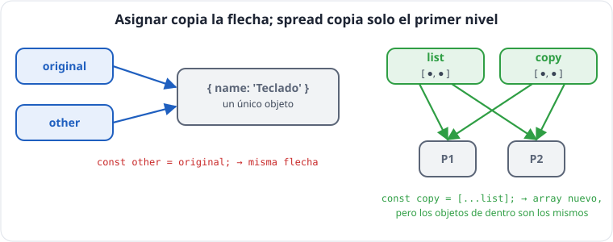
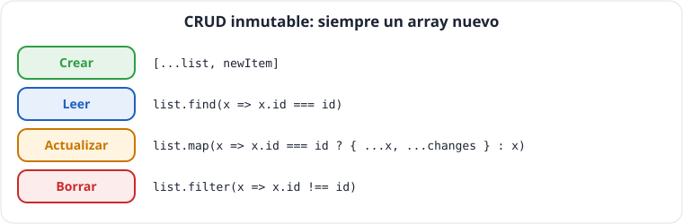
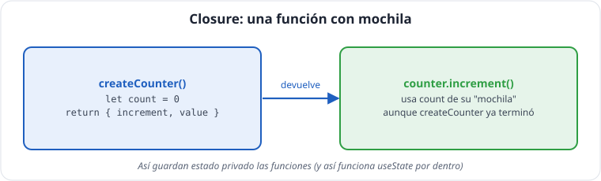

# Unidad 3 · Objetos, inmutabilidad, colecciones y funciones

*Apuntes de **Isaías FL** · Desarrollo Web en Entorno Cliente · 2.º DAW · Curso 2026‑27*

> **Qué vas a aprender:** a sacar datos de objetos y arrays (desestructurar), a copiarlos y actualizarlos **sin mutar**, a usar `Map` y `Set`, y a manejar funciones como valores: funciones que reciben o devuelven funciones y *closures*. Son las piezas con las que se construye el estado de cualquier aplicación React.

---

## Índice

1. [Desestructurar](#1-desestructurar)
2. [Spread y rest](#2-spread-y-rest)
3. [Referencias: la gran trampa](#3-referencias-la-gran-trampa)
4. [CRUD inmutable](#4-crud-inmutable)
5. [Utility types: tipos a partir de tipos](#5-utility-types-tipos-a-partir-de-tipos)
6. [Recorrer y transformar objetos](#6-recorrer-y-transformar-objetos)
7. [`Set`: colecciones sin repetidos](#7-set-colecciones-sin-repetidos)
8. [`Map`: diccionarios de verdad](#8-map-diccionarios-de-verdad)
9. [Funciones de orden superior](#9-funciones-de-orden-superior)
10. [Closures: funciones con memoria](#10-closures-funciones-con-memoria)
11. [Paradigmas: imperativo, funcional y orientado a objetos](#11-paradigmas)
12. [Autoevaluación](#12-autoevaluación)

---

## 1. Desestructurar

**Desestructurar** es sacar propiedades de un objeto (o posiciones de un array) a variables, en una línea.

### Objetos: por nombre

```ts
const keyboard = products[0];

const { name, price } = keyboard;                 // variables con el nombre de la propiedad
const { name: title, stock: units = 0 } = keyboard; // renombrar y valor por defecto
console.log(name, price, title, units);
```

### En el parámetro (lo más usado, y lo que hace React con las props)

```ts
function label({ name, price }: Product): string {
  return `${name} · ${price} €`;
}
console.log(label(products[0])); // 'Teclado mecánico · 80 €'
```

> **El tipo va después de toda la llave:** `({ name, price }: Product)`. Escribir `({ name: string })` **no tipa**: renombra `name` a una variable llamada `string`. TypeScript da el error *«Binding element 'string' implicitly has an 'any' type»*.

### Arrays: por posición

```ts
const [first, segundo] = products;
const [head, ...rest] = products;     // resto: Product[] con los demás
const [, , third] = products;          // saltar posiciones
console.log(first.name, segundo.name, head.name, rest.length, third.name);

// Intercambiar dos variables sin auxiliar
let a = 1;
let b = 2;
[a, b] = [b, a];
console.log(a, b); // 2 1
```

---

## 2. Spread y rest

Los mismos tres puntos `...` hacen dos cosas opuestas según dónde estén:

| | Dónde | Qué hace |
|---|---|---|
| **spread** (expandir) | al **crear** un array u objeto | copia sus elementos/propiedades dentro |
| **rest** (recoger) | al **desestructurar** o en **parámetros** | junta «lo que queda» en un array u objeto |

```ts
// spread
const copy = [...products];
const withOneMore = [...products, { id: 7, name: 'Webcam', price: 50, category: 'peripherals' as const, stock: 4 }];
const discounted = { ...products[0], price: 70 };   // copia + cambio (lo último gana)

// rest
const { id, ...withoutId } = products[0];             // withoutId: todo menos id
function sumAll(...numbers: number[]): number {
  return numbers.reduce((s, n) => s + n, 0);
}
console.log(copy.length, withOneMore.length, discounted.price, id, withoutId, sumAll(1, 2, 3));
```

> **Lo último gana:** `{ price: 60, ...product }` deja el precio original del producto. El orden importa.
> **Nota:** Un parámetro *rest* se tipa siempre como **array**: `...numbers: number[]`.

---

## 3. Referencias: la gran trampa

```ts
const original = { name: 'Teclado', price: 80 };
const other = original;
other.price = 0;
console.log(original.price); // 0  ¡sorpresa!
```

Las variables de objetos y arrays **no guardan el objeto**: guardan una **flecha** (referencia) hacia él. `other = original` copia **la flecha**.

```
original ──┐
           ├──▶ { name: 'Teclado', price: 0 }
otro ──────┘
```

### Copia superficial

`{ ...obj }` y `[...arr]` crean un objeto/array **nuevo**, pero **solo copian el primer nivel**: los objetos de dentro siguen siendo los mismos.

```ts
const listCopy = [...products];
console.log(listCopy === products);       // false: array nuevo
console.log(listCopy[0] === products[0]); // true: ¡el mismo producto dentro!
```

```
productos ──▶ [ ●, ●, ● ]      copiaLista ──▶ [ ●, ●, ● ]
                │  │  │                         │  │  │
                ▼  ▼  ▼                         │  │  │
              {P1}{P2}{P3} ◀────────────────────┴──┴──┘
```

### Copia profunda: `structuredClone`

**Ficha técnica · copiar y proteger objetos**

| Herramienta | Firma | Qué hace | Ojo |
|---|---|---|---|
| spread de objeto | `{ ...obj }` | copia **superficial** de las propiedades propias | los objetos internos se comparten |
| spread de array | `[...list]` | copia **superficial** | ídem |
| `structuredClone` | `structuredClone(value)` | copia **profunda** (todos los niveles). Copia también `Date`, `Map`, `Set`, arrays anidados | lanza `DataCloneError` si encuentra **funciones** (o elementos del DOM). Desde 2022 |
| `Object.assign` | `Object.assign(target, ...origenes)` | copia propiedades **sobre** `target` y lo devuelve | **muta** `target`; preferir spread |
| `Object.freeze` | `Object.freeze(obj)` | impide cambiar sus propiedades en ejecución | **superficial**: `freeze({ a: { b: 1 } }).a.b = 2` sí funciona |

```ts
const order = { customer: 'Isaías', lines: [{ productId: 1, quantity: 2 }] };
const clone = structuredClone(order);
clone.lines[0].quantity = 99;
console.log(order.lines[0].quantity); // 2: el original no cambia
```

`structuredClone` copia **todos los niveles**. Úsala cuando la necesites, pero en el código con estado lo normal es **copiar solo lo que cambia** (siguiente apartado).

> [!IMPORTANT]
> **Regla de oro de la inmutabilidad:** *no modifiques nada que no hayas creado tú en esa misma función. Para cambiar algo, crea una copia del nivel que cambia.*



---

## 4. CRUD inmutable



Las cuatro operaciones de cualquier aplicación, **sin modificar el original**. En React se escriben así en cada actualización de estado.

| Operación | Herramienta | Patrón |
|---|---|---|
| Crear | spread | `[...list, newItem]` |
| Leer | `find` / `filter` | `list.find((x) => x.id === id)` |
| Actualizar | `map` + spread | `list.map((x) => (x.id === id ? { ...x, change } : x))` |
| Eliminar | `filter` | `list.filter((x) => x.id !== id)` |

```ts
type NewProduct = Omit<Product, 'id'>;

function nextId(list: readonly Product[]): number {
  return list.reduce((max, p) => Math.max(max, p.id), 0) + 1;
}

function create(list: readonly Product[], data: NewProduct): Product[] {
  return [...list, { id: nextId(list), ...data }];
}

function updatePrice(list: readonly Product[], id: number, price: number): Product[] {
  return list.map((p) => (p.id === id ? { ...p, price } : p));
}

function remove(list: readonly Product[], id: number): Product[] {
  return list.filter((p) => p.id !== id);
}

const v1 = create(products, { name: 'Webcam HD', price: 50, category: 'peripherals', stock: 4 });
const v2 = updatePrice(v1, 3, 199);
const v3 = remove(v2, 2);
console.log(products.length, v3.length);          // 6 6
console.log(products[2].price, v2[2].price);   // 220 199
console.log(v2[0] === v1[0], v2[2] === v1[2]);    // true false
```

Fíjate en la última línea: los productos que **no** cambian se **reutilizan** (misma flecha) y el modificado es un objeto **nuevo**. Así es como React detecta qué ha cambiado: comparando referencias con `===`.

> [!TIP]
> **Consejo:** `nextId` usa el máximo, no `list.length + 1`: si se borra un producto, `length + 1` repetiría un `id`.

---

## 5. Utility types: tipos a partir de tipos

TypeScript trae «funciones de tipos» que crean un tipo nuevo a partir de otro, sin duplicar la `interface`:

| Utility | Se lee | Ejemplo de uso |
|---|---|---|
| `Omit<T, 'a'>` | T sin la propiedad `a` | datos para crear (sin `id`) |
| <code>Pick&lt;T, 'a' &#124; 'b'&gt;</code> | solo `a` y `b` de T | vistas resumidas |
| `Partial<T>` | todas opcionales | cambios parciales |
| `Required<T>` | todas obligatorias | completar datos |
| `Readonly<T>` | todas de solo lectura | estado que no se toca |
| `Record<K, V>` | objeto con claves K y valores V | diccionarios, tablas |

```ts
type ProductChanges = Partial<Omit<Product, 'id'>>;   // se lee de dentro hacia fuera
type ProductView = Pick<Product, 'id' | 'name' | 'price'>;

function update(list: readonly Product[], id: number, changes: ProductChanges): Product[] {
  return list.map((p) => (p.id === id ? { ...p, ...changes } : p));
}

const view: ProductView = { id: 1, name: 'Teclado', price: 80 };
console.log(update(products, 1, { stock: 0 })[0].stock, view);
// actualizar(productos, 1, { id: 9 }) (error) el id no se puede cambiar
// actualizar(productos, 1, { stok: 0 }) (error) errata detectada
```

---

## 6. Recorrer y transformar objetos

**Ficha técnica · métodos de `Object`**

| Método | Firma | Devuelve | Ojo |
|---|---|---|---|
| `Object.keys` | `Object.keys(obj)` | `string[]` con las claves **propias y enumerables** | no incluye claves `Symbol`; en TS el tipo es `string[]`, no `(keyof T)[]` |
| `Object.values` | `Object.values(obj)` | array con los valores | |
| `Object.entries` | `Object.entries(obj)` | array de parejas `[key, value]` | ideal con `for (const [k, v] of ...)` |
| `Object.fromEntries` | `Object.fromEntries(parejas)` | objeto nuevo a partir de un iterable de `[key, value]` (array o `Map`) | ES2019 |
| `Object.hasOwn` | `Object.hasOwn(obj, key)` | `true` si la propiedad es **propia** (no heredada) | ES2022; sustituye a `obj.function hasOwnProperty() { [native code] }(key)` |
| `Object.groupBy` | ver unidad 2 | | ES2024 |

```ts
const grades: Record<string, number> = { dwec: 8, dwes: 7, diw: 9 };

console.log(Object.keys(grades));     // ['dwec', 'dwes', 'diw']
console.log(Object.values(grades));   // [8, 7, 9]
console.log(Object.entries(grades));  // [['dwec', 8], ['dwes', 7], ['diw', 9]]

// Transformar un objeto: entries → map → fromEntries
const outOfHundred = Object.fromEntries(Object.entries(grades).map(([module, grade]) => [module, grade * 10]));
console.log(outOfHundred); // { dwec: 80, dwes: 70, diw: 90 }

// ¿Tiene esta propiedad propia? (moderno, sustituye a hasOwnProperty)
console.log(Object.hasOwn(grades, 'dwec')); // true
```

---

## 7. `Set`: colecciones sin repetidos

**Ficha técnica · `Set<T>`**

| Miembro | Firma | Devuelve | Ojo |
|---|---|---|---|
| constructor | `new Set<T>(iterable?)` | un conjunto con los valores **sin repetir** | vacío: indica el tipo, `new Set<string>()` |
| `add` | `set.add(value)` | **el propio Set** (se puede encadenar) | **muta** |
| `has` | `set.has(value)` | `boolean` | muy rápido, aunque haya miles de elementos |
| `delete` | `set.delete(value)` | `true` si estaba y lo borró, `false` si no estaba | **muta** |
| `clear` | `set.clear()` | `undefined` | **muta** |
| `size` | propiedad | `number` | |
| `values` / `keys` / `entries` / `forEach` | | iteradores; `forEach((value) => ...)` | orden de inserción |
| `union` / `intersection` / `difference` / `symmetricDifference` | `a.union(b)` | un `Set` **nuevo** | ES2025 |
| `isSubsetOf` / `isSupersetOf` / `isDisjointFrom` | `a.isSubsetOf(b)` | `boolean` | ES2025 |

**Comparación de valores:** igualdad *SameValueZero* (como `===`, pero `NaN` es igual a `NaN`). Los objetos se comparan **por referencia**: dos objetos `{ id: 1 }` distintos son dos elementos.

```ts
const tags = new Set<string>();
tags.add('oferta');
tags.add('nuevo');
tags.add('oferta');        // ya estaba: se ignora
console.log(tags.size, tags.has('nuevo')); // 2 true
tags.delete('nuevo');
```

| Array | Set |
|---|---|
| `push` | `add` |
| `includes` | `has` (mucho más rápido) |
| `length` | `size` |

> [!WARNING]
> **Atención:** Un `Set` vacío **necesita el tipo**: `new Set<string>()`. Sin él, TypeScript lo trata como `Set<unknown>`.

### Quitar duplicados

```ts
const categories = [...new Set(products.map((p) => p.category))];
console.log(categories); // ['peripherals', 'monitors', 'audio']
```

### Actualizar un Set sin mutar

```ts
function toggleFavorite(favorites: ReadonlySet<number>, id: number): Set<number> {
  const copy = new Set(favorites);
  if (copy.has(id)) {
    copy.delete(id);
  } else {
    copy.add(id);
  }
  return copy;
}
console.log([...toggleFavorite(new Set([1, 3]), 3)]); // [1]
```

`ReadonlySet` en el parámetro **promete** que la función no toca el original.

### Operaciones de conjuntos (ES2025)

```ts
const isaiasFollows = new Set(['dwec', 'dwes', 'daw']);
const luciaFollows = new Set(['dwec', 'diw']);

console.log(isaiasFollows.union(luciaFollows));         // dwec, dwes, daw, diw
console.log(isaiasFollows.intersection(luciaFollows));  // dwec
console.log(isaiasFollows.difference(luciaFollows));    // dwes, daw
console.log(new Set(['dwec']).isSubsetOf(isaiasFollows)); // true
```

> [!NOTE]
> **Nota:** Requiere `"lib": ["ES2025", ...]` en el `tsconfig.json`.

---

## 8. `Map`: diccionarios de verdad

**Ficha técnica · `Map<K, V>`**

| Miembro | Firma | Devuelve | Ojo |
|---|---|---|---|
| constructor | `new Map<K, V>(parejas?)` | un mapa; `parejas` es un iterable de `[key, value]` | vacío: indica los tipos |
| `set` | `map.set(key, value)` | **el propio Map** (encadenable) | **muta**; si la clave existe, sustituye el valor |
| `get` | `map.get(key)` | <code>V &#124; undefined</code> | compruébalo siempre antes de usarlo |
| `has` | `map.has(key)` | `boolean` | |
| `delete` | `map.delete(key)` | `true` si existía | **muta** |
| `clear` / `size` | | | |
| `keys` / `values` / `entries` | | iteradores en **orden de inserción** | `for (const [k, v] of map)` usa `entries` |
| `forEach` | `map.forEach((value, key, map) => ...)` | `undefined` | ojo al orden: **primero el valor**, después la clave |
| `Map.groupBy` | `Map.groupBy(items, key)` | `Map<K, T[]>` | ES2024 |

> [!IMPORTANT]
> **Claves:** pueden ser de cualquier tipo. Se comparan como en `Set`: `NaN` encuentra `NaN`, pero un objeto solo se encuentra con **la misma referencia** (`new Map([[{}, 1]]).get({})` es `undefined`).

Un `Map` guarda **parejas clave → valor**. La clave puede ser de **cualquier tipo**, mantiene el orden de inserción y tiene `size`.

```ts
const stockById = new Map<number, number>();
stockById.set(1, 5).set(3, 3);       // set devuelve el Map: se puede encadenar
console.log(stockById.get(1));       // 5
console.log(stockById.get(99));      // undefined → tipo number | undefined
console.log(stockById.has(3), stockById.size);
```

> [!IMPORTANT]
> **Clave:** `get` **siempre** devuelve `value | undefined`: compruébalo antes de usarlo (igual que con `find`).

### Índice para buscar rápido

```ts
const index = new Map(products.map((p) => [p.id, p]));   // Map<number, Product>
console.log(index.get(3)?.name ?? 'desconocido');
```

`find` recorre el array en cada búsqueda; `Map.get` va directo. Si buscas muchas veces por `id`, prepara un índice.

### Contar y agrupar

```ts
const units = new Map<Category, number>();
for (const p of products) {
  units.set(p.category, (units.get(p.category) ?? 0) + p.stock);   // patrón contador
}
console.log(units);

// 🆕 ES2024: agrupar en un Map en una línea (requiere lib ES2025)
const groups = Map.groupBy(products, (p) => (p.stock > 0 ? 'con stock' : 'soldOut'));
console.log(groups.get('soldOut')?.map((p) => p.name));
```

### Recorrer

```ts
const grades = new Map([['Lucía', 9], ['Marcos', 5]]);
for (const [student, grade] of grades) {
  console.log(`${student}: ${grade}`);
}
console.log([...grades.keys()], [...grades.values()]);
```

### ¿Map/Set o array/objeto?

| | Array / objeto / `Record` | `Map` / `Set` |
|---|---|---|
| Guardar en JSON / `localStorage` | directo | hay que convertir |
| Claves | texto | cualquier tipo |
| Uso típico | **estado** de la aplicación | **cálculos**: índices, únicos, agrupaciones |

**Ejemplo comentado: el mismo dato con objeto y con `Map`.**

```ts
// Con un objeto (Record): claves de texto; se guarda en JSON tal cual
const stockObject: Record<string, number> = { keyboard: 5, mouse: 0 };
console.log(stockObject['keyboard']);                     // 5
console.log(JSON.stringify(stockObject));                 // '{"keyboard":5,"mouse":0}'

// Con un Map: cualquier tipo de clave, tamaño directo, orden de inserción
const stockMap = new Map<number, number>([[1, 5], [2, 0]]);   // id → unidades
console.log(stockMap.get(1), stockMap.size);              // 5 2
console.log(JSON.stringify(stockMap));                    // '{}'  ← un Map NO se guarda en JSON directamente
console.log(JSON.stringify([...stockMap]));               // '[[1,5],[2,0]]'  ← primero, a array de parejas
```

---

## 9. Funciones de orden superior

En JavaScript las funciones son **valores**: se guardan en variables, se pasan y se devuelven. Una función que **recibe** o **devuelve** otra se llama **de orden superior**. Ya las usas: `map`, `filter`, `find`...

### Tipos de función

```ts
type Predicate = (p: Product) => boolean;
```

Se lee: *«una función que recibe un `Product` y devuelve un `boolean`»*. La flecha aquí es la notación **del tipo**. En React, las props de eventos se tipan así: `onRemove: (id: number) => void`.

### Recibir una función

```ts
type Predicate = (p: Product) => boolean;

function countIf(list: readonly Product[], condition: Predicate): number {
  return list.filter(condition).length;
}
const inStock: Predicate = (p) => p.stock > 0;     // p tipado por el contexto

console.log(countIf(products, inStock));              // 4
console.log(countIf(products, (p) => p.price > 100)); // 2
```

> **Sin paréntesis la pasas; con paréntesis la ejecutas.** `countIf(products, inStock())` es un error. En React: `onClick={remove}` frente a `onClick={remove()}`.

### Devolver una función: fábricas

```ts
type Predicate = (p: Product) => boolean;

function maxPrice(max: number): Predicate {
  return (p) => p.price <= max;
}
function byCategory(category: Category): Predicate {
  return (p) => p.category === category;
}
function allOf(...conditions: Predicate[]): Predicate {
  return (p) => conditions.every((c) => c(p));
}

const audioBargains = allOf(byCategory('audio'), maxPrice(50));
console.log(products.filter(audioBargains).map((p) => p.name)); // ['Micrófono USB']
```

Componer funciones pequeñas para formar otras más grandes es **programación funcional**: así se escriben reglas de negocio, validaciones y filtros combinables.

**Ejemplo comentado: las funciones son valores.**

```ts
// 1. Guardar una función en una variable
const toUpper = (text: string): string => text.toUpperCase();

// 2. Pasarla como argumento: SIN paréntesis (se pasa, no se ejecuta)
const names = ['lucía', 'marcos'].map(toUpper);      // ['LUCÍA', 'MARCOS']

// 3. Devolverla desde otra función
function greeter(greeting: string): (name: string) => string {
  return (name) => `${greeting}, ${name}`;           // la función devuelta recuerda "greeting"
}
const hello = greeter('Hola');

console.log(names, hello('Isaías'));                 // [...] 'Hola, Isaías'
```

---

## 10. Closures: funciones con memoria



Una función **recuerda las variables del lugar donde se creó**, aunque ese lugar ya haya terminado. Eso es un **closure**.

```ts
function createDiscount(percentage: number): (price: number) => number {
  return (price) => Math.round(price * (1 - percentage / 100) * 100) / 100;
}
const blackFriday = createDiscount(20);
console.log(blackFriday(80), blackFriday(25)); // 64 20
```

### Estado privado

```ts
interface Counter {
  increment: () => number;
  value: () => number;
}

function createCounter(initial = 0): Counter {
  let count = initial;           // nadie de fuera puede tocarla directamente
  return {
    increment: () => {
      count += 1;
      return count;
    },
    value: () => count,
  };
}

const isaiasVisits = createCounter();
isaiasVisits.increment();
isaiasVisits.increment();
console.log(isaiasVisits.value()); // 2
```

> [!TIP]
> **Consejo:** *Un closure es una función con mochila: lleva dentro las variables de donde nació.* El `useState` de React se apoya en esta idea.

---

## 11. Paradigmas

El mismo problema, *total del precio de los productos disponibles*, de tres formas:

```ts
// 1. IMPERATIVO: digo CÓMO, paso a paso, mutando variables
function totalImperative(list: readonly Product[]): number {
  let total = 0;
  for (let i = 0; i < list.length; i++) {
    if (list[i].stock > 0) total += list[i].price;
  }
  return total;
}

// 2. DECLARATIVO / FUNCIONAL: digo QUÉ quiero, sin mutar
const totalFunctional = (list: readonly Product[]): number =>
  list.filter((p) => p.stock > 0).reduce((t, p) => t + p.price, 0);

// 3. ORIENTADO A OBJETOS: datos y comportamiento juntos
class Inventory {
  readonly #products: readonly Product[];
  constructor(products: readonly Product[]) {
    this.#products = products;
  }
  totalAvailable(): number {
    return this.#products.filter((p) => p.stock > 0).reduce((t, p) => t + p.price, 0);
  }
}

console.log(totalImperative(products), totalFunctional(products), new Inventory(products).totalAvailable()); // 405 405 405
```

| Paradigma | Idea | Dónde lo verás |
|---|---|---|
| Imperativo | instrucciones paso a paso | algoritmos, bucles complejos |
| **Funcional / declarativo** | funciones puras, datos inmutables | **React**, transformación de datos |
| Orientado a objetos | clases con estado y métodos | Java, Angular, backend, librerías |

> [!IMPORTANT]
> **Clave:** React es **declarativo y funcional**: describes **qué** se ve según los datos, no **cómo** cambiar la pantalla paso a paso. Por eso este curso trabaja así. Las clases las verás en la unidad 8.

---

## 12. Autoevaluación

- [ ] Desestructura `name` y `stock` de un producto en el parámetro de una función.
- [ ] `const b = a;` siendo `a` un objeto. Si cambias `b.x`, ¿cambia `a.x`? ¿Por qué?
- [ ] ¿Qué copia `[...list]` y qué no copia?
- [ ] Escribe el patrón para actualizar el `stock` del producto con `id` 4 sin mutar.
- [ ] ¿Qué significa `Partial<Omit<Product, 'id'>>`?
- [ ] ¿Qué devuelve `[...new Set([1, 1, 2])]`?
- [ ] ¿Qué tipo devuelve `map.get(key)` en un `Map<number, string>`?
- [ ] ¿Qué es un closure? Pon un ejemplo con un contador.
