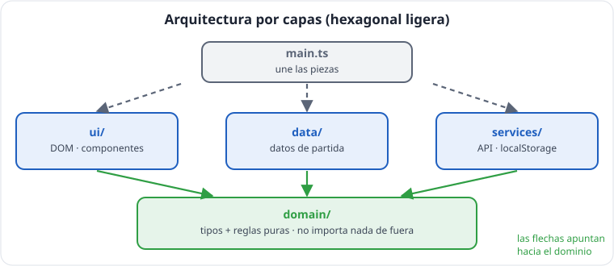
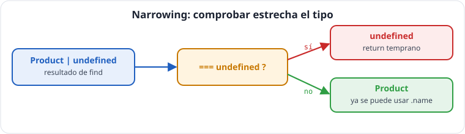

# Unidad 4 · Módulos, arquitectura por capas y tipos avanzados

*Apuntes de **Isaías FL** · Desarrollo Web en Entorno Cliente · 2.º DAW · Curso 2026‑27*

> **Qué vas a aprender:** a organizar un proyecto como en una empresa (módulos y capas), y las herramientas de TypeScript que hacen el código más seguro: *narrowing*, uniones discriminadas, `never`, genéricos, `keyof`, `satisfies` y *type guards*. Con ellas modelarás estados como `cargando | error | listo`, que usarás en todas las aplicaciones React.

---

## Índice

1. [Módulos: `export` e `import`](#1-módulos-export-e-import)
2. [Arquitectura por capas](#2-arquitectura-por-capas)
3. [Barriles](#3-barriles)
4. [Narrowing: la caja de herramientas](#4-narrowing-la-caja-de-herramientas)
5. [Uniones discriminadas](#5-uniones-discriminadas)
6. [`switch` exhaustivo con `never`](#6-switch-exhaustivo-con-never)
7. [Genéricos](#7-genéricos)
8. [`keyof`, `typeof`, `as const` y `satisfies`](#8-keyof-typeof-as-const-y-satisfies)
9. [Type guards: validar datos desconocidos](#9-type-guards-validar-datos-desconocidos)
10. [El tipo `Result`](#10-el-tipo-resultado)
11. [Autoevaluación](#11-autoevaluación)

---

## 1. Módulos: `export` e `import`

Cada fichero `.ts` es un **módulo**: lo que no se exporta, no se ve desde fuera.

```ts
// (fragmento) domain/product.ts
export type Category = 'peripherals' | 'monitors' | 'audio';
export interface Product { readonly id: number; name: string; price: number; category: Category; stock: number }

// domain/catalog.ts
import type { Product } from './product';          // solo un tipo → import type
export function available(list: readonly Product[]): Product[] {
  return list.filter((p) => p.stock > 0);
}

// main.ts
import { available } from './domain/catalog';    // un valor (código)
import { available as inStock } from './domain/catalog'; // renombrar al importar
```

### Las reglas del curso

| # | Regla | Por qué |
|---|---|---|
| 1 | **Exports con nombre** (`export function`), no `export default` | el nombre es único en todo el proyecto: buscar y renombrar es fiable |
| 2 | `import type` para tipos | obligatorio con `verbatimModuleSyntax`; deja claro que no es código |
| 3 | Rutas relativas sin extensión (`./`, `../`) | así resuelve Vite |
| 4 | Un fichero, una responsabilidad | fácil de encontrar y de probar |
| 5 | Los módulos **no ejecutan nada** al importarse (salvo `main.ts`) | importar no debe tener efectos inesperados |
| 6 | Sin imports circulares | provocan valores `undefined` muy difíciles de rastrear |

```ts
// (fragmento) Importar un valor y un tipo del mismo módulo, dos formas válidas
import { cartTotal } from '../domain';
import type { Cart } from '../domain';
// o en una línea:
import { cartTotal, type Cart } from '../domain';
```

---

## 2. Arquitectura por capas



```
┌──────────────────────────────────────────────────────┐
│  main.ts  →  COMPONE: une las piezas                 │
└──────┬─────────────────┬──────────────────┬──────────┘
       ▼                 ▼                  ▼
┌────────────┐   ┌──────────────┐   ┌──────────────────┐
│    ui/     │   │    data/    │   │    services/    │
│ CÓMO se ve │   │ data de     │   │ API, localStorage│
│ console,   │   │ partida      │   │ (adaptadores)    │
│ DOM, React │   │              │   │                  │
└─────┬──────┘   └──────┬───────┘   └────────┬─────────┘
      └─────────────────┼────────────────────┘
                        ▼
┌──────────────────────────────────────────────────────┐
│  domain/  →  QUÉ es y QUÉ reglas tiene              │
│  types + funciones puras. NO importa nada de fuera.  │
└──────────────────────────────────────────────────────┘
```

> **La regla de dependencias:** *las flechas apuntan hacia el dominio. El dominio nunca importa de `ui/` ni de `services/`.*

**¿Dónde va cada cosa?** Pregúntate: *«¿cambiaría si mañana usáramos React en vez de consola, o otra API?»* Si sí, va fuera del dominio.

| Si la función... | va a |
|---|---|
| define un tipo, calcula o transforma datos | `domain/` |
| solo contiene datos de ejemplo | `data/` |
| muestra algo (consola, DOM, componentes) | `ui/` |
| habla con el exterior (API, `localStorage`) | `services/` |

> [!NOTE]
> **En la empresa** oirás: *separación de responsabilidades*, *arquitectura en capas*, *arquitectura hexagonal* (o *puertos y adaptadores*), *Clean Architecture*. Todas dicen lo mismo con distinto detalle: **el núcleo de negocio no depende de los detalles técnicos**. Nuestra versión ligera: `domain/` es el núcleo; `ui/` y `services/` son adaptadores. La recompensa: en noviembre, el `domain/` de TechStore Isaías FL se copiará **sin tocarlo** a un proyecto React.

---

## 3. Barriles

Un **barril** (*barrel*) es un `index.ts` que reexporta lo público de una carpeta:

```ts
// (fragmento) domain/index.ts
export type { Category, NewProduct, Product } from './product';
export type { Cart, CartLine } from './cart';
export { findById, createProduct, available } from './catalog';
export { addToCart, cartTotal } from './cart';

// Desde fuera:
import { available, type Product } from './domain';
```

- Los **tipos** se reexportan con `export type { ... } from`.
- **Dentro** de la carpeta, los ficheros se importan entre sí **directamente** (`./product`), no a través de su propio barril, para evitar ciclos.

---

## 4. Narrowing: la caja de herramientas



Cuando un valor puede ser varias cosas, TypeScript no deja usarlo hasta que **compruebas** cuál es. Tras la comprobación, **estrecha** el tipo dentro de ese bloque.

| Comprobación | Distingue | Ejemplo |
|---|---|---|
| `typeof x === 'string'` | primitivos | <code>string &#124; number</code> |
| `Array.isArray(x)` | arrays | <code>string &#124; string[]</code> |
| `'prop' in x` | objetos con propiedades distintas | <code>Physical &#124; Digital</code> |
| `x instanceof Error` | objetos creados con clases | errores |
| `x.type === 'a'` | uniones discriminadas | estados |
| `x === null`, `x === undefined` | ausencia | `find`, `Map.get` |

```ts
function toText(value: string | number | string[]): string {
  if (typeof value === 'number') return value.toFixed(2);   // aquí: number
  if (Array.isArray(value)) return value.join(', ');        // aquí: string[]
  return value;                                             // por eliminación: string
}

interface Physical { type: 'physical'; weight: number }
interface Digital { type: 'digital'; downloadUrl: string }

function shipping(item: Physical | Digital): string {
  if ('weight' in item) return `Envío por peso: ${item.weight} kg`;
  return `Descarga: ${item.downloadUrl}`;
}

function errorMessage(error: unknown): string {
  if (error instanceof Error) return error.message;
  return 'Error desconocido';
}

console.log(toText(3), toText(['a', 'b']), shipping({ type: 'digital', downloadUrl: '/isaias.zip' }), errorMessage(new Error('falló')));
```

> [!WARNING]
> **Atención:** `typeof null === 'object'` (error histórico de JavaScript) y `typeof []` también es `'object'`. Para arrays, `Array.isArray`; para objetos, comprueba además `!== null`.
> **Atención:** En un `catch (error)`, `error` es de tipo **`unknown`**: cualquier cosa se puede lanzar. Usa `errorMessage`.

---

## 5. Uniones discriminadas

### El problema: estados imposibles

```ts
// MAL: todo opcional permite combinaciones absurdas
interface BadOrder {
  state: 'pending' | 'paid' | 'shipped' | 'cancelled';
  paidAt?: string;
  tracking?: string;   // ¿un pedido pendiente con seguimiento?
  reason?: string;        // ¿un pedido enviado con motivo de cancelación?
}
```

### La solución

```ts
type OrderState =
  | { state: 'pending' }
  | { state: 'paid'; paidAt: string }
  | { state: 'shipped'; paidAt: string; tracking: string }
  | { state: 'cancelled'; reason: string };
```

Todos los casos comparten una propiedad (el **discriminante**, aquí `state`) con un **literal distinto**, y cada uno lleva **solo** los datos que tienen sentido en él.

> **Haz que los estados imposibles sean imposibles de escribir.**

```ts
type OrderState =
  | { state: 'pending' }
  | { state: 'paid'; paidAt: string }
  | { state: 'shipped'; paidAt: string; tracking: string }
  | { state: 'cancelled'; reason: string };

function ship(p: OrderState, tracking: string): OrderState {
  if (p.state !== 'paid') return p;     // regla: solo se envía lo pagado
  return { state: 'shipped', paidAt: p.paidAt, tracking };   // aquí p tiene paidAt
}
console.log(ship({ state: 'paid', paidAt: '2026-10-16' }, 'ES-ISAIAS-001'));
```

### El estado de carga (lo usarás siempre)

```ts
type LoadState<T> =
  | { type: 'loading' }
  | { type: 'error'; message: string }
  | { type: 'ready'; data: T };
```

Toda pantalla que pide datos está en uno de estos tres estados. Nunca «cargando y con error a la vez».

---

## 6. `switch` exhaustivo con `never`

```ts
type OrderState =
  | { state: 'pending' }
  | { state: 'paid'; paidAt: string }
  | { state: 'shipped'; paidAt: string; tracking: string }
  | { state: 'cancelled'; reason: string };

function describe(p: OrderState): string {
  switch (p.state) {
    case 'pending':
      return 'Pendiente de pago';
    case 'paid':
      return `Pagado el ${p.paidAt}`;
    case 'shipped':
      return `Enviado · seguimiento ${p.tracking}`;
    case 'cancelled':
      return `Cancelado: ${p.reason}`;
    default: {
      const impossible: never = p;
      return impossible;
    }
  }
}
console.log(describe({ state: 'cancelled', reason: 'Isaías cambió de idea' }));
```

Si todos los casos están cubiertos, en `default` no queda ninguna posibilidad: `p` es `never` («ningún valor»). Si mañana alguien añade `{ state: 'returned' }` y olvida el `case`, salta un error **justo ahí**: *«Type '{ estado: "devuelto"; }' is not assignable to type 'never'»*. Es una **alarma** que te obliga a actualizar todos los `switch`.

---

## 7. Genéricos

Un **genérico** es un «hueco para un tipo» que se rellena al usar la función:

```ts
function last<T>(list: readonly T[]): T | undefined {
  return list.at(-1);
}
const n = last([1, 2, 3]);         // T = number → number | undefined
const s = last(['Isaías', 'FL']);  // T = string → string | undefined
console.log(n, s);
```

> [!IMPORTANT]
> **Clave:** *El tipo que entra decide el que sale.* `T` es una convención (de *Type*); puede llamarse como quieras.

**Ya los usabas sin saberlo:** `Array<number>`, `Record<Category, number>`, `Map<number, Product>`, `Set<string>`, `Omit<Product, 'id'>`, `Promise<Product[]>`...

### Restricciones con `extends`

```ts
function findById<T extends { id: number }>(list: readonly T[], id: number): T | undefined {
  return list.find((x) => x.id === id);
}

function updateById<T extends { id: number }>(list: readonly T[], id: number, changes: Partial<Omit<T, 'id'>>): T[] {
  return list.map((x) => (x.id === id ? { ...x, ...changes } : x));
}

const tasks = [{ id: 1, title: 'Corregir prácticas de Isaías', done: false }];
console.log(findById(products, 3)?.name, updateById(tasks, 1, { done: true }));
// findById([1, 2, 3], 1) (error) number no tiene id
```

`T extends { id: number }` se lee: *«T puede ser cualquier tipo **que tenga** un `id` numérico»*. Aquí `extends` **no es herencia**: significa «que cumpla».

### Tipos genéricos

```ts
type LoadState<T> = { type: 'loading' } | { type: 'error'; message: string } | { type: 'ready'; data: T };

const productsState: LoadState<Product[]> = { type: 'ready', data: products };
const userState: LoadState<string> = { type: 'loading' };
console.log(productsState.type, userState.type);
```

---

## 8. `keyof`, `typeof`, `as const` y `satisfies`

```ts
// keyof: la unión de los NOMBRES de las propiedades
type ProductField = keyof Product;   // 'id' | 'name' | 'price' | 'category' | 'stock'

function sortBy(list: readonly Product[], field: 'price' | 'stock'): Product[] {
  return list.toSorted((a, b) => a[field] - b[field]);
}

// typeof (de tipos): "el tipo de esta variable"
const config = { theme: 'dark', size: 14 };
type Config = typeof config;   // { tema: string; tamano: number }

// as const: literales de solo lectura
const PAYMENT_METHODS = ['card', 'bizum', 'transfer'] as const;
type PaymentMethod = (typeof PAYMENT_METHODS)[number];   // 'card' | 'bizum' | 'transfer'

const field: ProductField = 'price';
const payment: PaymentMethod = 'bizum';
const cfg: Config = { theme: 'light', size: 12 };
console.log(sortBy(products, 'stock')[0].name, field, payment, cfg);
```

### `satisfies`: comprobar sin perder precisión

```ts
type Currency = 'EUR' | 'USD';

// Con anotación, TS "olvida" los detalles: cada valor pasa a ser string
const annotatedSymbols: Record<Currency, string> = { EUR: '€', USD: '$' };

// Con satisfies, COMPRUEBA que cumple el tipo y CONSERVA el tipo exacto
const symbols = { EUR: '€', USD: '$' } as const satisfies Record<Currency, string>;
const euro: '€' = symbols.EUR;   // el tipo exacto se conserva
console.log(annotatedSymbols.EUR, euro);
// { EUR: '€' } satisfies Record<Currency, string> (error) falta USD
```

`satisfies` es **seguro**: no afirma nada, comprueba. No lo confundas con `as`.

| Sintaxis | Qué hace | Veredicto |
|---|---|---|
| `x as T` | «créeme, es un T» | **Atención:** no comprueba nada |
| `x!` | «créeme, no es null» | evitar |
| `x satisfies T` | «comprueba que cumple T» | seguro |

---

## 9. Type guards: validar datos desconocidos

Lo que llega de **fuera** (`JSON.parse`, `localStorage`, una API) es `unknown`. Una función con retorno `raw is Tipo` comprueba de verdad y **demuestra** el tipo a TypeScript:

```ts
const CATEGORIES: readonly Category[] = ['peripherals', 'monitors', 'audio'];

function isCategory(value: unknown): value is Category {
  return typeof value === 'string' && CATEGORIES.some((c) => c === value);
}

function isProduct(raw: unknown): raw is Product {
  if (typeof raw !== 'object' || raw === null) return false;
  if (!('id' in raw) || !('name' in raw) || !('price' in raw) || !('category' in raw) || !('stock' in raw)) {
    return false;
  }
  // tras los "in", TS sabe que existen esas propiedades (de tipo unknown)
  return (
    typeof raw.id === 'number' &&
    typeof raw.name === 'string' && raw.name.trim() !== '' &&
    typeof raw.price === 'number' && raw.price >= 0 &&
    typeof raw.stock === 'number' && Number.isInteger(raw.stock) && raw.stock >= 0 &&
    isCategory(raw.category)
  );
}

const received: unknown = JSON.parse('{"id":7,"nombre":"Webcam","precio":50,"categoria":"perifericos","stock":4}');
if (isProduct(received)) {
  console.log(received.name);   // aquí llegado es Product, sin "as"
}
```

> [!WARNING]
> **Atención:** TypeScript **se fía** de lo que compruebes dentro. Si la comprobación está incompleta, el tipo mentirá. Comprueba **todas** las propiedades que vayas a usar.
> **En la empresa:** En la empresa se usan librerías como **Zod** que generan estas comprobaciones. Hacerlo a mano te enseña qué hacen.

Los type guards funcionan también en `filter` y `every`:

```ts
function isNumber(x: unknown): x is number {
  return typeof x === 'number';
}
const mixed: unknown[] = [1, 'dos', 3];
const onlyNumbers = mixed.filter(isNumber);   // number[]
console.log(onlyNumbers);
```

---

## 10. El tipo `Result`

Una forma de devolver errores **sin lanzar excepciones**: quien llama está **obligado** a mirar `ok`.

```ts
type Result<T> = { ok: true; value: T } | { ok: false; error: string };

function readProducts(text: string): Result<Product[]> {
  let raw: unknown;
  try {
    raw = JSON.parse(text);
  } catch {
    return { ok: false, error: 'El texto no es JSON válido' };
  }
  if (!Array.isArray(raw)) return { ok: false, error: 'Se esperaba una lista' };
  const valid = raw.filter((d): d is Product => typeof d === 'object' && d !== null && 'id' in d);
  return { ok: true, value: valid };
}

const r = readProducts('esto no es json');
if (r.ok) {
  console.log(r.value.length);
} else {
  console.log(`Error para Isaías: ${r.error}`);
}
```

> [!NOTE]
> **En la empresa:** Este patrón se llama *Result* o *Either* y es habitual en código profesional.

---

## 11. Autoevaluación

- [ ] ¿Por qué el curso usa exports con nombre y no `export default`?
- [ ] ¿En qué capa va `formatPrice`? ¿Y `cartTotal`? ¿Puede el dominio importar de `ui/`?
- [ ] ¿Qué es el «discriminante» de una unión discriminada?
- [ ] ¿Para qué sirve `const impossible: never = p` en el `default` de un `switch`?
- [ ] En `function f<T extends { id: number }>`, ¿qué significa `extends`?
- [ ] ¿Qué diferencia hay entre `as` y `satisfies`?
- [ ] ¿Qué significa el tipo de retorno `raw is Product`?
