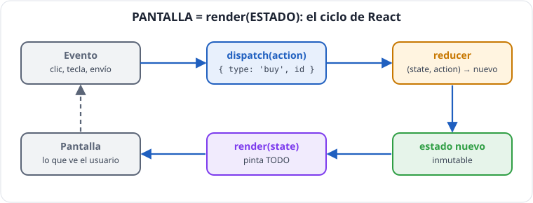
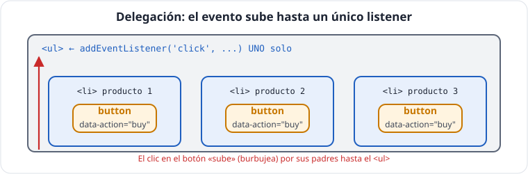

# Unidad 5 · El DOM con TypeScript: elementos, eventos y estado

*Apuntes de **Isaías FL** · Desarrollo Web en Entorno Cliente · 2.º DAW · Curso 2026‑27*

> **Qué vas a aprender:** a seleccionar elementos **comprobando** que existen y son del tipo correcto, a crear contenido de forma **segura**, a escuchar eventos con sus tipos, y el patrón que hace funcionar a React: **estado → render** con un reductor y delegación de eventos.

---

## Índice

1. [El DOM y sus tipos](#1-el-dom-y-sus-tipos)
2. [Seleccionar elementos con seguridad](#2-seleccionar-elementos-con-seguridad)
3. [Crear y modificar elementos](#3-crear-y-modificar-elementos)
4. [`textContent` frente a `innerHTML`: seguridad](#4-textcontent-frente-a-innerhtml-seguridad)
5. [Eventos](#5-eventos)
6. [Estado → render](#6-estado--render)
7. [Acciones y reductor](#7-acciones-y-reductor)
8. [Delegación de eventos](#8-delegación-de-eventos)
9. [Autoevaluación](#9-autoevaluación)

---

## 1. El DOM y sus tipos

El **DOM** es el árbol de objetos que el navegador construye a partir del HTML. TypeScript tiene un tipo para cada clase de elemento:

```
EventTarget
 └── Node
      └── Element
           └── HTMLElement          textContent, classList, dataset, hidden...
                ├── HTMLInputElement     .value, .checked
                ├── HTMLButtonElement    .disabled
                ├── HTMLSelectElement    .value
                ├── HTMLFormElement      .reset(), .elements
                ├── HTMLUListElement
                ├── HTMLLIElement
                └── ...
```

Cuanto más concreto es el tipo, más propiedades tiene: solo un `HTMLInputElement` tiene `.value`.

---

## 2. Seleccionar elementos con seguridad

**Ficha técnica · seleccionar**

| Método | Firma | Devuelve | Ojo |
|---|---|---|---|
| `querySelector` | `root.querySelector(selectorCss)` | el **primer** elemento que coincide, o `null`. Tipo: <code>Element &#124; null</code> (o el tipo concreto si el selector es una etiqueta: `querySelector('input')` → <code>HTMLInputElement &#124; null</code>) | selector CSS inválido → `SyntaxError` |
| `querySelectorAll` | `root.querySelectorAll(selectorCss)` | `NodeList` **estática** con todos (puede estar vacía) | no es un array: tiene `forEach` y `length`; para `map`/`filter`, `[...list]` |
| `getElementById` | `document.getElementById(id)` | <code>HTMLElement &#124; null</code> | sin `#` delante del id |
| `closest` | `element.closest(selectorCss)` | el propio elemento o el **antepasado** más cercano que coincide, o `null` | se incluye a sí mismo |
| `matches` | `element.matches(selectorCss)` | `boolean` | |

`root` puede ser `document` o cualquier elemento (busca solo dentro de él).

```ts
const list = document.querySelector('#list');
// tipo: Element | null
```

Dos problemas: puede ser **`null`** (si el selector no existe) y su tipo es **demasiado general** (`Element` no tiene `.value`).

### Tres formas, de peor a mejor

```ts
// MAL: 1. Afirmar: compila, pero si no existe o es otro elemento, revienta en ejecución
const b1 = document.querySelector('#search')! as HTMLInputElement;

// OJO: 2. Genérico de querySelector: SIGUE SIN COMPROBAR que sea un input
const b2 = document.querySelector<HTMLInputElement>('#search'); // HTMLInputElement | null
```

```ts
// BIEN: 3. Comprobar de verdad con instanceof
const searchInput = document.querySelector('#search');
if (!(searchInput instanceof HTMLInputElement)) {
  throw new Error('Falta #search o no es un input');
}
console.log(searchInput.value);   // aquí TS sabe que es HTMLInputElement
```

`instanceof` se **ejecuta** en el navegador: es la única que comprueba de verdad.

### Un helper genérico para no repetir

```ts
function getElement<T extends Element>(selector: string, type: new () => T): T {
  const element = document.querySelector(selector);
  if (!(element instanceof type)) {
    throw new Error(`No se encuentra ${selector} o no es del tipo esperado`);
  }
  return element;
}

// Se pasa la CLASE del elemento, sin comillas
const searchField = getElement('#search', HTMLInputElement);    // HTMLInputElement
const productList = getElement('#list', HTMLUListElement); // HTMLUListElement
console.log(searchField, productList);
```

- `type: new () => T` → «una clase que se puede construir con `new` y produce un `T`».
- Si falta un elemento del HTML, es un error **del programador**: mejor que falle **al arrancar** con un mensaje claro.

---

## 3. Crear y modificar elementos

**Ficha técnica · crear y modificar**

| Miembro | Firma | Devuelve | Ojo |
|---|---|---|---|
| `createElement` | `document.createElement(label)` | el elemento con su tipo exacto (`'li'` → `HTMLLIElement`) | aún no está en la página hasta que se añade |
| `append` / `prepend` | `parent.append(...nodesOrTexts)` | `undefined` | acepta textos (se añaden como texto, seguros) |
| `replaceChildren` | `parent.replaceChildren(...nodesOrTexts)` | `undefined` | sin argumentos, vacía el elemento |
| `remove` | `element.remove()` | `undefined` | se quita a sí mismo |
| `textContent` | propiedad (`string`) | lee o escribe el **texto** | al escribir, sustituye todo el contenido |
| `innerHTML` | propiedad (`string`) | lee o escribe **HTML** | riesgo de XSS con datos externos |
| `classList` | `add(...)`, `remove(...)`, `contains(c)`, `toggle(c, force?)` | `toggle` devuelve `boolean`: si la clase queda puesta | |
| `dataset` | `element.dataset.name` | <code>string &#124; undefined</code> | `data-product-id` ⟷ `dataset.productId`; **siempre texto** |
| `setAttribute` / `getAttribute` / `removeAttribute` | `el.getAttribute(name)` | `getAttribute` → <code>string &#124; null</code> | |
| `hidden` / `disabled` | propiedades `boolean` | | `disabled` solo en controles de formulario |

```ts
function createCard(p: Product): HTMLLIElement {
  const li = document.createElement('li');      // tipo HTMLLIElement automáticamente
  li.classList.add('card');
  li.classList.toggle('tarjeta--agotado', p.stock === 0);   // añade o quita según la condición
  li.dataset.id = String(p.id);                  // atributo data-id="..."

  const name = document.createElement('span');
  name.textContent = p.name;

  const price = document.createElement('span');
  price.textContent = `${p.price.toFixed(2)} €`;

  li.append(name, price);                     // añade varios hijos (nodos o textos)
  return li;
}

function renderList(container: HTMLElement, list: readonly Product[]): void {
  if (list.length === 0) {
    const empty = document.createElement('li');
    empty.textContent = 'No hay productos que mostrar';
    container.replaceChildren(empty);
    return;
  }
  container.replaceChildren(...list.map(createCard));   // borra y pone lo nuevo
}
```

| Método moderno | Para qué |
|---|---|
| `append(...nodes)` | añadir al final (acepta textos) |
| `prepend(...nodes)` | añadir al principio |
| `replaceChildren(...nodes)` | sustituir todo el contenido (sin argumentos: vaciar) |
| `remove()` | quitarse a sí mismo |
| `classList.toggle(className, condición)` | poner o quitar una clase según un booleano |
| `dataset.x` | leer/escribir `data-x` (siempre texto) |

> [!TIP]
> **Consejo:** `list.map(createCard)`: el `map` de la unidad 2 convierte datos en elementos. En React escribirás `products.map(p => <Card product={p} />)`.
> **Consejo:** Piensa siempre en el **estado vacío**: una pantalla en blanco parece un error.

### Plantillas HTML con `<template>`

Para estructuras grandes, define el HTML una vez y clónalo:

```ts
// (fragmento) En el HTML:
// <template id="plantilla-tarjeta"><li class="card"><span class="name"></span><span class="price"></span></li></template>
const template = getElement('#card-template', HTMLTemplateElement);
const copy = template.content.cloneNode(true);
if (copy instanceof DocumentFragment) {
  const name = copy.querySelector('.name');
  if (name instanceof HTMLElement) name.textContent = 'Teclado mecánico';
}
```

---

## 4. `textContent` frente a `innerHTML`: seguridad

Imagina que un producto se llama así (porque alguien lo escribió en un formulario):

```ts
const dangerousName = '';
const zone = document.createElement('div');

zone.textContent = dangerousName;   // BIEN: se ve el TEXTO literal
// zona.innerHTML = dangerousName;  // MAL: el navegador lo INTERPRETA y ejecuta el código
console.log(zone.textContent);
```

Esto se llama **XSS** (*cross-site scripting*): un dato acaba ejecutándose como código en el navegador de otros usuarios. Puede robar sesiones.

> [!IMPORTANT]
> **Regla:** datos del usuario o de una API, **siempre** con `textContent`. `innerHTML` solo con HTML fijo escrito por ti. React aplica esta protección automáticamente.

---

## 5. Eventos

**Ficha técnica · `addEventListener`**

| | |
|---|---|
| **Firma** | `target.addEventListener(type, handler, options?)` |
| **`type`** | nombre del evento sin `on`: `'click'`, `'input'`, `'submit'`... |
| **`handler`** | `(event: EventType) => void`. TS deduce el tipo por el nombre (`'click'` → `MouseEvent`) |
| **`options`** | `{ once?: boolean; signal?: AbortSignal; passive?: boolean; capture?: boolean }` |
| **Devuelve** | `undefined` |
| **Quitar** | `removeEventListener(type, sameFunction)` o, mejor, `{ signal }` + `controller.abort()` |
| **Registrar dos veces la misma función** | no la duplica (se ignora la segunda) |

**Ficha técnica · el objeto evento (`Event`)**

| Miembro | Qué es |
|---|---|
| `type` | el nombre del evento |
| `target` | el elemento **exacto** donde ocurrió (tipo <code>EventTarget &#124; null</code>) |
| `currentTarget` | el elemento que tiene el **listener** (en la delegación, el contenedor) |
| `preventDefault()` | cancela la acción por defecto (enviar formulario, seguir enlace) |
| `stopPropagation()` | impide que el evento siga subiendo a los padres (úsalo con moderación: rompe la delegación) |
| `KeyboardEvent.key` | la tecla: `'Enter'`, `'Escape'`, `'ArrowUp'`, `'a'`... |
| `MouseEvent.clientX` / `clientY` | posición del ratón |

```ts
const button = document.createElement('button');
let clicks = 0;

button.addEventListener('click', (event) => {
  // evento: MouseEvent (TS lo deduce por el nombre 'click')
  clicks += 1;
  button.textContent = `Clics de Isaías: ${clicks}`;
  console.log(event.clientX, event.clientY);
});
```

| Evento | Cuándo | Tipo del evento |
|---|---|---|
| `click` | clic | `MouseEvent` |
| `input` | cada cambio del valor | `InputEvent` |
| `change` | al confirmar (checkbox, select) | `Event` |
| `keydown` | tecla pulsada | `KeyboardEvent` |
| `submit` | enviar un formulario | `SubmitEvent` |

> **Pasa la función, no la ejecutes:**
> `button.addEventListener('click', render)` · `button.addEventListener('click', render())` (la ejecuta una vez al registrar).

> [!WARNING]
> **Atención:** Si escribes el manejador **aparte**, tipa su parámetro: `function onClick(event: MouseEvent): void`.

> [!WARNING]
> **Atención:** `event.target` es `EventTarget | null`: no tiene `.value`. Usa la variable del elemento que ya tienes tipada, o comprueba con `instanceof`.

### Opciones modernas de `addEventListener`

```ts
const eventZone = document.createElement('div');
const controller = new AbortController();

eventZone.addEventListener('click', () => console.log('solo la primera vez'), { once: true });
eventZone.addEventListener('keydown', (e) => console.log(e.key), { signal: controller.signal });

controller.abort();   // quita TODOS los listeners registrados con esa señal
```

`{ signal }` es la forma moderna de **quitar listeners** sin guardar referencias a las funciones.

---

## 6. Estado → render



### El problema

Si cada botón modifica el DOM «a su manera» (uno añade un `<li>`, otro cambia un número...), tarde o temprano **la pantalla y los datos dejan de coincidir**.

### La solución: una sola fuente de verdad

```
        PANTALLA = render(ESTADO)
```

- Toda la información vive en **un objeto**: el **estado**.
- **Una** función, `render`, pinta **todo** a partir del estado.
- **Nunca** se leen datos del DOM ni se modifica a trozos.

```ts
// (fragmento)
let state: ShopState = { catalog: initialProducts, cart: [], filter: '' };

function render(): void {
  renderCatalog(list, filterByText(state.catalog, state.filter));
  renderCart(cartList, total, state.cart, state.catalog);
}
```

> [!IMPORTANT]
> **Clave:** Esta ecuación **es React**: allí se escribe `UI = f(state)`.

**Ejemplo completo comentado: un contador con estado → render.** Cópialo en un `main.ts` vacío de un proyecto Vite y pruébalo:

```ts
// 1. ESTADO: toda la información, en un objeto (inmutable)
interface CounterState {
  readonly count: number;
}

// 2. ACCIONES: qué puede pasar
type CounterAction = { type: 'increment' } | { type: 'reset' };

// 3. REDUCTOR: estado actual + acción → estado NUEVO (función pura, sin DOM)
function counterReducer(state: CounterState, action: CounterAction): CounterState {
  switch (action.type) {
    case 'increment':
      return { count: state.count + 1 };
    case 'reset':
      return { count: 0 };
  }
}

// 4. VISTA: los elementos se crean una vez
const output = document.createElement('p');
const addButton = document.createElement('button');
const resetButton = document.createElement('button');
addButton.textContent = 'Sumar';
resetButton.textContent = 'Reiniciar';
document.body.append(output, addButton, resetButton);

let state: CounterState = { count: 0 };

// render: pinta a partir del estado (nunca lee el DOM)
function render(): void {
  output.textContent = `Isaías ha pulsado ${state.count} veces`;
  resetButton.disabled = state.count === 0;
}

// dispatch: la ÚNICA forma de cambiar el estado
function dispatch(action: CounterAction): void {
  state = counterReducer(state, action);   // a) estado nuevo
  render();                                 // b) repintar
}

// 5. EVENTOS → acciones
addButton.addEventListener('click', () => dispatch({ type: 'increment' }));
resetButton.addEventListener('click', () => dispatch({ type: 'reset' }));

render();   // primera pintura
```

Fíjate en que los eventos **no tocan el DOM**: solo despachan acciones. Todo lo que se ve sale de `render`.

---

## 7. Acciones y reductor

¿Cómo cambia el estado? Con **acciones** (objetos que describen qué ha pasado) y un **reductor** (función pura que devuelve el estado nuevo):

```ts
interface CartLine { productId: number; quantity: number }

interface ShopState {
  readonly catalog: readonly Product[];
  readonly cart: readonly CartLine[];
  readonly filter: string;
}

type Action =
  | { type: 'buy'; id: number }
  | { type: 'filter'; text: string };

function reducer(state: ShopState, action: Action): ShopState {
  switch (action.type) {
    case 'buy': {
      const product = state.catalog.find((p) => p.id === action.id);
      if (product === undefined || product.stock === 0) return state;   // nada cambia
      const exists = state.cart.some((l) => l.productId === action.id);
      return {
        ...state,
        catalog: state.catalog.map((p) => (p.id === action.id ? { ...p, stock: p.stock - 1 } : p)),
        cart: exists
          ? state.cart.map((l) => (l.productId === action.id ? { ...l, quantity: l.quantity + 1 } : l))
          : [...state.cart, { productId: action.id, quantity: 1 }],
      };
    }
    case 'filter':
      return { ...state, filter: action.text };
    default: {
      const impossible: never = action;
      return impossible;
    }
  }
}

let state: ShopState = { catalog: products, cart: [], filter: '' };
state = reducer(state, { type: 'buy', id: 1 });
state = reducer(state, { type: 'buy', id: 2 });   // agotado: no cambia nada
console.log(state.cart);   // [{ productId: 1, cantidad: 1 }]
```

```ts
// (fragmento) La ÚNICA forma de cambiar el estado
function dispatch(action: Action): void {
  state = reducer(state, action);
  render();
}
```

```
 clic ──▶ dispatch(acción) ──▶ reducer(estado, acción) ──▶ estado nuevo ──▶ render() ──▶ pantalla
```

- El reductor es **puro**: no toca el DOM; se puede probar con `console.log`.
- Si nada cambia, devuelve **el mismo** objeto: así se sabe que no hay que repintar.
- Las reglas de negocio viven en **un solo sitio**.

> [!NOTE]
> **En la empresa:** Este patrón se llama **reducer**: es el de **Redux** y el del hook **`useReducer`** de React.

---

## 8. Delegación de eventos



Cada `render` crea botones nuevos. En lugar de poner un listener a cada uno, se pone **uno** en el contenedor, que no cambia, y se pregunta **qué botón** se pulsó. Funciona porque los eventos **suben** (*burbujean*) desde el elemento pulsado hasta sus padres.

```ts
function createButton(text: string, action: string, id: number): HTMLButtonElement {
  const b = document.createElement('button');
  b.type = 'button';
  b.textContent = text;
  b.dataset.action = action;     // data-action="buy"
  b.dataset.id = String(id);     // data-id="4"  (los data-* son siempre texto)
  return b;
}

function onButtonClick(event: MouseEvent): void {
  if (!(event.target instanceof Element)) return;
  const button = event.target.closest('button[data-action]');   // sube hasta un botón con data-action
  if (!(button instanceof HTMLButtonElement)) return;             // se pulsó fuera de un botón
  const id = Number(button.dataset.id);                           // texto → número
  if (!Number.isInteger(id)) return;                             // validar
  console.log(`Acción ${button.dataset.action} sobre el producto ${id}`);
}

const container = document.createElement('ul');
container.append(createButton('Añadir', 'buy', 4));
container.addEventListener('click', onButtonClick);
```

Tres comprobaciones y ningún `as`:

1. `event.target instanceof Element` → para poder usar `closest`.
2. `button instanceof HTMLButtonElement` → descarta clics fuera de un botón.
3. `Number.isInteger(id)` → `dataset.id` puede faltar (`undefined` → `NaN`).

> [!TIP]
> **Consejo:** `closest` resuelve un problema típico: si el botón tiene un icono dentro y pulsas el icono, `target` es el icono; `closest` sube hasta el botón.

---

## 9. Autoevaluación

- [ ] ¿Qué tipo devuelve `document.querySelector('#x')`?
- [ ] ¿Por qué `querySelector<HTMLInputElement>(...)` no es una comprobación real?
- [ ] ¿Por qué `textContent` y no `innerHTML` para mostrar el nombre que escribe un usuario?
- [ ] ¿Qué falla en `button.addEventListener('click', render())`?
- [ ] Completa: `PANTALLA = ______(ESTADO)`.
- [ ] ¿Qué hace un reductor y por qué debe ser puro?
- [ ] ¿Por qué ponemos el listener en el `<ul>` y no en cada botón?
