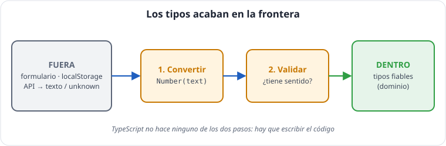

# Unidad 6 · Formularios, validación y persistencia

*Apuntes de **Isaías FL** · Desarrollo Web en Entorno Cliente · 2.º DAW · Curso 2026‑27*

> **Qué vas a aprender:** a leer formularios con `FormData`, a **convertir y validar** lo que escribe el usuario, a mostrar errores accesibles por campo y a guardar datos en el navegador con `localStorage` **sin fiarte** de lo que lees. La idea central de la unidad: **los tipos acaban en la frontera**.

---

## Índice

1. [La idea clave: la frontera](#1-la-idea-clave-la-frontera)
2. [El formulario y el evento `submit`](#2-el-formulario-y-el-evento-submit)
3. [Leer con `FormData`](#3-leer-con-formdata)
4. [Convertir no es validar](#4-convertir-no-es-validar)
5. [Validar en el dominio](#5-validar-en-el-dominio)
6. [Mostrar los errores](#6-mostrar-los-errores)
7. [`localStorage`: guardar en el navegador](#7-localstorage-guardar-en-el-navegador)
8. [Cargar con desconfianza](#8-cargar-con-desconfianza)
9. [Autoevaluación](#9-autoevaluación)

---

## 1. La idea clave: la frontera

Dentro de tu código, TypeScript garantiza los tipos. Pero lo que entra desde **fuera** no tiene tipo real:

| Frontera | Qué llega de verdad |
|---|---|
| Un formulario | **texto** (`string`), aunque el campo sea un número |
| `localStorage` | **texto** o `null` |
| `JSON.parse` | **`any`** → guárdalo como `unknown` |
| Una API (unidad 7) | `any` → guárdalo como `unknown` |

> **En la frontera: convertir y validar con código.** TypeScript no hace ninguna de las dos cosas.



**Ejemplo comentado: un precio que llega de un formulario.**

```ts
const typed: string = '49,90';                         // lo que escribió el usuario: SIEMPRE texto

const converted = Number(typed.replace(',', '.'));     // 1. convertir → 49.9
const isValid = Number.isFinite(converted) && converted > 0;   // 2. validar: ¿tiene sentido?

if (isValid) {
  console.log(`Precio aceptado: ${converted} €`);       // 3. ya se puede usar como number
} else {
  console.log('Precio no válido');
}
```

---

## 2. El formulario y el evento `submit`

**Ficha técnica · `HTMLFormElement`**

| Miembro | Qué hace |
|---|---|
| evento `submit` | se lanza al pulsar un botón `type="submit"` o Enter en un campo. Tipo: `SubmitEvent` |
| `event.preventDefault()` | evita el envío y la recarga de la página |
| `form.elements.namedItem(name)` | el control con ese `name`: <code>Element &#124; RadioNodeList &#124; null</code> |
| `form.reset()` | vuelve los campos a sus valores iniciales |
| `form.requestSubmit()` | envía como si se pulsara el botón (lanza `submit` y la validación HTML) |
| `form.submit()` | envía **sin** lanzar el evento `submit` (evítalo) |

```html
<form id="product-form" novalidate>
  <label>Nombre <input name="name" /></label>
  <small data-error-for="name"></small>

  <label>Precio (€) <input name="price" inputmode="decimal" /></label>
  <small data-error-for="price"></small>

  <label>Categoría
    <select name="category">
      <option value="">— Elige —</option>
      <option value="peripherals">Periféricos</option>
      <option value="monitors">Monitores</option>
      <option value="audio">Audio</option>
    </select>
  </label>
  <small data-error-for="category"></small>

  <label>Stock <input name="stock" inputmode="numeric" /></label>
  <small data-error-for="stock"></small>

  <button type="submit">Añadir a TechStore Isaías FL</button>
</form>
```

- `name="..."` es **la clave** con la que se lee cada campo. Sin `name`, el campo no existe para `FormData`.
- `novalidate` desactiva la validación del navegador para hacerla **nosotros**, con mensajes propios. La validación HTML (`required`, `min`) ayuda, pero **se salta** fácilmente con las herramientas del navegador.
- `inputmode` muestra el teclado adecuado en el móvil.

```ts
const form = document.createElement('form');
form.addEventListener('submit', (event) => {
  event.preventDefault();          // ¡primera línea siempre! Si no, la página se recarga
  // leer → validar → usar
});
```

Escucha `submit` en el **formulario** (no `click` en el botón): así funciona también al pulsar **Enter**.

---

## 3. Leer con `FormData`

**Ficha técnica · `FormData`**

| Miembro | Firma | Devuelve | Ojo |
|---|---|---|---|
| constructor | `new FormData(form?)` | los campos con `name` y su valor actual | los campos `disabled` y los checkbox **desmarcados** no se incluyen |
| `get` | `data.get(name)` | <code>FormDataEntryValue &#124; null</code> = <code>string &#124; File &#124; null</code> | `null` si no existe |
| `getAll` | `data.getAll(name)` | `FormDataEntryValue[]` | para varios campos con el mismo `name` |
| `has` | `data.has(name)` | `boolean` | |
| `set` / `append` / `delete` | `data.set(name, value)` | `undefined` | `set` sustituye; `append` añade otro valor |
| `entries` | `data.entries()` | iterador de `[name, value]` | `Object.fromEntries(data)` lo convierte en objeto |

```ts
type ProductField = 'name' | 'price' | 'category' | 'stock';
type FormValues = Record<ProductField, string>;   // TODO texto: es la verdad de la frontera

// FormData.get devuelve FormDataEntryValue | null  (= string | File | null)
function text(data: FormData, field: string): string {
  const value = data.get(field);
  return typeof value === 'string' ? value : '';
}

function readForm(form: HTMLFormElement): FormValues {
  const data = new FormData(form);
  return {
    name: text(data, 'name'),
    price: text(data, 'price'),
    category: text(data, 'category'),
    stock: text(data, 'stock'),
  };
}
```

> [!TIP]
> **Consejo:** `Record<ProductField, string>` obliga a leer **exactamente** los cuatro campos. Si añades uno a `ProductField`, TypeScript te avisará en `readForm`.

### Casos especiales

```ts
const f = new FormData();
const favorite = f.get('favorite') !== null;   // un checkbox DESMARCADO no aparece en FormData
const tags = f.getAll('etiqueta');        // varios campos con el mismo name
const todo = Object.fromEntries(f);            // { nombre: ..., precio: ... } (valores string | File)
console.log(favorite, tags, todo);
```

---

## 4. Convertir no es validar

```
 TEXTO del formulario ──1. CONVERTIR──▶ número ──2. VALIDAR──▶ ¿tiene sentido? ──3. USAR
   "49,90"                Number(...)     49.9      > 0, finito          NuevoProducto
```

- **Convertir** es cambiar el tipo: `Number('49.9')`.
- **Validar** es comprobar que el valor tiene sentido **para el negocio**: un precio negativo es un número válido para JavaScript, pero no para una tienda.

### Las trampas de la conversión

| Expresión | Resultado | ¿Problema? |
|---|---|---|
| `Number('42')` | `42` | Sí |
| `Number('')` | **`0`** | **Atención:** un campo vacío se convierte en 0 |
| `Number('   ')` | **`0`** | **Atención:** |
| `Number('49,90')` | `NaN` | **Atención:** la coma decimal española |
| `Number('12abc')` | `NaN` | |
| `parseInt('12abc')` | **`12`** | **Atención:** acepta basura al final |

> [!IMPORTANT]
> **Clave:** Usa `Number` (no `parseInt`), comprueba **el vacío aparte** y valida con `Number.isFinite` o `Number.isInteger`.

**Pruébalo tú: cada línea con su resultado real.**

```ts
console.log(Number(''));                      // 0      ¡un campo vacío parece un cero!
console.log(Number('   '));                   // 0      espacios: también cero
console.log(Number('49,90'));                 // NaN    la coma decimal no se entiende
console.log(Number('12abc'));                 // NaN    bien: no acepta basura
console.log(Number.parseInt('12abc', 10));    // 12     mal: acepta basura al final
console.log(Number.isNaN(Number('abc')));     // true   así se detecta un número no válido
```

---

## 5. Validar en el dominio

La validación es una **regla de negocio**: va en `domain/`, sin DOM. Devuelve una **unión discriminada** con el valor bueno o los errores **de todos los campos**:

```ts
type NewProduct = Omit<Product, 'id'>;
type ProductField = 'name' | 'price' | 'category' | 'stock';
type FormValues = Record<ProductField, string>;
type FormErrors = Partial<Record<ProductField, string>>;

type ValidationResult =
  | { ok: true; value: NewProduct }
  | { ok: false; errors: FormErrors };

const CATEGORIES: readonly Category[] = ['peripherals', 'monitors', 'audio'];
const isCategory = (v: unknown): v is Category => typeof v === 'string' && CATEGORIES.some((c) => c === v);

function validateNewProduct(data: FormValues): ValidationResult {
  const errors: FormErrors = {};

  const name = data.name.trim();
  if (name.length < 3) errors.name = 'Mínimo 3 caracteres';

  const price = Number(data.price.replace(',', '.'));      // 1. convertir (admite coma)
  if (data.price.trim() === '' || !Number.isFinite(price) || price <= 0) {
    errors.price = 'Precio mayor que 0';                     // 2. validar
  }

  const stock = Number(data.stock);
  if (data.stock.trim() === '' || !Number.isInteger(stock) || stock < 0) {
    errors.stock = 'Número entero, 0 o más';
  }

  const category = data.category;
  if (!isCategory(category)) errors.category = 'Elige una categoría';

  if (Object.keys(errors).length > 0 || !isCategory(category)) {
    return { ok: false, errors };
  }
  return { ok: true, value: { name, price: Math.round(price * 100) / 100, category, stock } };
}

console.log(validateNewProduct({ name: 'ab', price: '-3', category: '', stock: '2.5' }));
console.log(validateNewProduct({ name: 'Webcam de Isaías', price: '49,90', category: 'peripherals', stock: '4' }));
```

- Se **acumulan** todos los errores: el usuario ve de una vez todo lo que debe corregir.
- `replace(',', '.')`: el usuario escribe `49,90`. Pensar en el usuario también es validar.
- ¿Por qué se repite `!isCategory(category)` al final? Porque TypeScript **no relaciona** «`errors` está vacío» con «la categoría es válida». La comprobación directa **estrecha** el tipo y permite construir el producto sin `as`.

---

## 6. Mostrar los errores

```ts
const FIELDS: readonly ProductField[] = ['name', 'price', 'category', 'stock'];
type ProductField = 'name' | 'price' | 'category' | 'stock';
type FormErrors = Partial<Record<ProductField, string>>;

function showErrors(form: HTMLFormElement, errors: FormErrors): void {
  for (const field of FIELDS) {
    const input = form.elements.namedItem(field);          // Element | RadioNodeList | null
    const output = form.querySelector(`[data-error-for="${field}"]`);
    const message = errors[field] ?? '';
    if (input instanceof HTMLInputElement || input instanceof HTMLSelectElement) {
      input.setAttribute('aria-invalid', String(message !== ''));
    }
    if (output instanceof HTMLElement) output.textContent = message;
  }
}
```

```ts
// (fragmento) El submit completo
form.addEventListener('submit', (event) => {
  event.preventDefault();
  const result = validateNewProduct(readForm(form));
  if (!result.ok) {
    showErrors(form, result.errors);   // aquí TS sabe que hay "errores"
    return;
  }
  showErrors(form, {});                     // limpiar mensajes anteriores
  dispatch({ type: 'create', data: result.value });   // aquí, que hay "valor"
  form.reset();
});
```

> [!NOTE]
> **Accesibilidad:** `aria-invalid="true"` hace que los lectores de pantalla anuncien el error, y con CSS (`[aria-invalid="true"] { border-color: red }`) se marca en rojo. Accesibilidad sin esfuerzo extra.

---

## 7. `localStorage`: guardar en el navegador

**Ficha técnica · `localStorage` / `sessionStorage` (`Storage`)**

| Miembro | Firma | Devuelve | Ojo |
|---|---|---|---|
| `setItem` | `localStorage.setItem(key, value)` | `undefined` | solo guarda **texto**; puede lanzar `QuotaExceededError` (lleno, unos 5 MB por origen) |
| `getItem` | `localStorage.getItem(key)` | <code>string &#124; null</code> | `null` si la clave no existe |
| `removeItem` | `localStorage.removeItem(key)` | `undefined` | |
| `clear` | `localStorage.clear()` | `undefined` | borra **todo** lo de ese origen |
| `key` / `length` | `localStorage.key(i)` | nombre de la clave en la posición `i` | |

Es **síncrono** y compartido por todas las pestañas del mismo origen (protocolo + dominio + puerto).

**Ficha técnica · `JSON`**

| Método | Firma | Devuelve | Ojo |
|---|---|---|---|
| `JSON.stringify` | `JSON.stringify(value, replacer?, space?)` | `string` (o `undefined` si `value` es `undefined` o una función) | omite propiedades `undefined` y funciones; `Map` y `Set` → `{}`; `Date` → texto ISO; `NaN`/`Infinity` → `null`. `space` (p. ej. `2`) indenta |
| `JSON.parse` | `JSON.parse(text, reviver?)` | `any` → guárdalo como `unknown` | texto inválido → lanza `SyntaxError` |

`localStorage` guarda **texto** en el navegador, por dominio, y **sobrevive** a recargar y a cerrar.

```ts
localStorage.setItem('tema', 'dark');
const theme = localStorage.getItem('tema');      // string | null (null si no existe)
localStorage.removeItem('tema');

// Objetos: a JSON y de JSON
const cart = [{ productId: 1, quantity: 2 }];
localStorage.setItem('cart', JSON.stringify(cart));
console.log(theme);
```

| | `localStorage` | `sessionStorage` |
|---|---|---|
| Dura | hasta que se borre | hasta cerrar la pestaña |
| Uso típico | carrito, preferencias | datos temporales de un proceso |

> **Puede fallar:** en algunos modos privados o con el almacenamiento lleno, `setItem` lanza un error. Envuélvelo en `try/catch` y que la aplicación siga funcionando sin guardar.
> **No guardes secretos** (contraseñas, tokens): cualquier script de la página puede leerlo.
> **¿Y las cookies?** Sirven para que el **servidor** reciba datos (sesiones, autenticación). Para guardar el estado de una aplicación en el navegador se usa `localStorage`. No las usaremos.

---

## 8. Cargar con desconfianza

`JSON.parse` devuelve **`any`**: si escribes `const data: Product[] = JSON.parse(text)`, compila aunque sea basura. El usuario puede editar `localStorage` en las herramientas del navegador, o los datos pueden venir de una versión antigua de tu aplicación.

```ts
interface CartLine { productId: number; quantity: number }
const STORAGE_KEY = 'techstore-isaias-v1';   // versión en la clave: si cambia el formato, se cambia la clave

function isCartLine(raw: unknown): raw is CartLine {
  if (typeof raw !== 'object' || raw === null) return false;
  if (!('productId' in raw) || !('quantity' in raw)) return false;
  return typeof raw.productId === 'number' && typeof raw.quantity === 'number' && raw.quantity > 0;
}

function saveCart(cart: readonly CartLine[]): void {
  try {
    localStorage.setItem(STORAGE_KEY, JSON.stringify(cart));
  } catch {
    console.warn('No se pudo guardar: la aplicación sigue funcionando');
  }
}

function loadCart(): CartLine[] {
  try {
    const text = localStorage.getItem(STORAGE_KEY);
    if (text === null) return [];                      // primera visita
    const raw: unknown = JSON.parse(text);            // ← unknown, NO any
    return Array.isArray(raw) && raw.every(isCartLine) ? raw : [];
  } catch {
    return [];                                          // texto corrupto o almacenamiento bloqueado
  }
}
```

- `raw.every(isCartLine)` usa el *type guard* como predicado: si devuelve `true`, `raw` es `CartLine[]`.
- Si algo no cuadra, se devuelve un valor seguro (`[]`) en vez de romper la aplicación.
- **Solo este fichero** (`services/storage.ts`) sabe que existe `localStorage`. Si mañana guardas en un servidor, cambias este fichero y nada más.

---

## 9. Autoevaluación

- [ ] ¿Qué pasa si olvidas `event.preventDefault()` en un `submit`?
- [ ] ¿Qué tipo devuelve `new FormData(form).get('price')`?
- [ ] ¿Qué devuelve `Number('')`? ¿Y `parseInt('12abc')`? ¿Por qué son peligrosos?
- [ ] ¿Por qué la validación va en el dominio y no en el evento `submit`?
- [ ] ¿Qué tipo devuelve `JSON.parse` y cómo lo tratamos?
- [ ] ¿Por qué la clave de `localStorage` lleva `v1`?
- [ ] ¿Cómo sabes si un checkbox estaba marcado usando `FormData`?
