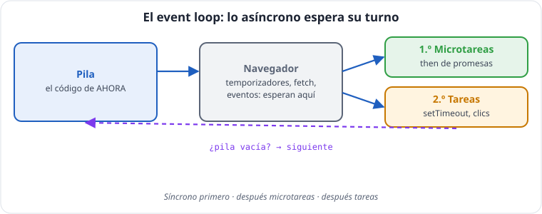
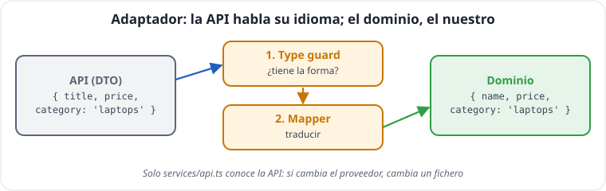
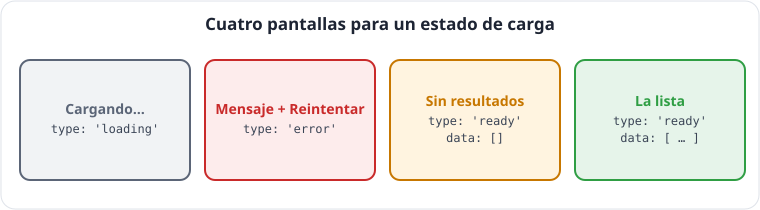

# Unidad 7 · Asincronía y datos de internet

*Apuntes de **Isaías FL** · Desarrollo Web en Entorno Cliente · 2.º DAW · Curso 2026‑27*

> **Qué vas a aprender:** cómo JavaScript espera sin bloquearse (el *event loop*), las promesas, `async`/`await`, cómo pedir datos con `fetch` **sin caer en sus trampas**, cómo validar y traducir lo que manda una API (DTO y adaptador), y cómo mostrar en pantalla los estados de carga, cancelar peticiones y evitar saturar el servidor.

---

## Índice

1. [Síncrono y asíncrono](#1-síncrono-y-asíncrono)
2. [El event loop](#2-el-event-loop)
3. [Promesas](#3-promesas)
4. [Combinar promesas](#4-combinar-promesas)
5. [`async` / `await`](#5-async--await)
6. [`fetch` y sus dos trampas](#6-fetch-y-sus-dos-trampas)
7. [DTO y adaptador: traducir la API](#7-dto-y-adaptador-traducir-la-api)
8. [Estados de carga en pantalla](#8-estados-de-carga-en-pantalla)
9. [Cancelar y limitar: `AbortController`, timeout y debounce](#9-cancelar-y-limitar)
10. [Errores con significado](#10-errores-con-significado)
11. [Autoevaluación](#11-autoevaluación)

> **API de prácticas:** [dummyjson.com](https://dummyjson.com/docs/products), pública, gratuita y sin registro.

---

## 1. Síncrono y asíncrono

JavaScript tiene **un solo hilo**: hace **una cosa a la vez**. Si esperar a un servidor fuera síncrono, la página se **congelaría** (sin scroll, sin clics) hasta recibir la respuesta.

> **La carnicería:** síncrono es quedarte en el mostrador sin moverte hasta que te atiendan; nadie más avanza. Asíncrono es **coger número**, ir a por el pan y volver cuando cantan tu turno.

La asincronía **no** es hacer dos cosas a la vez: es **no quedarse esperando**.

**Ejemplo comentado: la página no se queda esperando.**

```ts
console.log('1. Isaías pide los datos al servidor');

setTimeout(() => {
  console.log('3. Llegan los datos (simulamos 1 segundo de espera)');
}, 1000);

console.log('2. Mientras tanto, la página sigue respondiendo');
// Salida: 1, 2 y, un segundo después, 3
```

---

## 2. El event loop



```ts
console.log('1. síncrono: inicio');
setTimeout(() => console.log('4. tarea: setTimeout 0'), 0);
Promise.resolve().then(() => console.log('3. microtarea: promesa'));
console.log('2. síncrono: fin');
```

```
 ┌──────────────────┐     ┌──────────────────────────┐
 │ PILA (call stack) │────▶│ NAVEGADOR: temporizadores,│
 │ código de AHORA   │     │ fetch, eventos esperan    │
 └────────▲─────────┘     └────────────┬─────────────┘
          │                            ▼  al terminar, encolan su función
          │        ┌────────────────────────────────────┐
          │        │ 1.º MICROTAREAS: then de promesas   │ ← prioridad
          │        ├────────────────────────────────────┤
          └────────│ 2.º TAREAS: setTimeout, clics...    │
    EVENT LOOP     └────────────────────────────────────┘
```

1. Lo **síncrono** siempre termina antes que cualquier cosa asíncrona.
2. `setTimeout(f, 0)` no significa «ahora»: significa «en cuanto quede libre».
3. Las promesas (microtareas) se cuelan antes que los temporizadores.

---

## 3. Promesas

Una **promesa** representa un valor **que todavía no tienes**. Tiene tres estados: **pendiente**, **cumplida** (con un valor) o **rechazada** (con un error).

### Crear

**Ficha técnica · `new Promise` y temporizadores**

| Miembro | Firma | Devuelve | Ojo |
|---|---|---|---|
| constructor | `new Promise<T>((resolve, reject) => { ... })` | `Promise<T>` | la función (el *executor*) se ejecuta **inmediatamente y de forma síncrona**; si lanza un error, la promesa queda rechazada |
| `resolve` | `resolve(value)` | — | cumple la promesa; solo cuenta la primera llamada |
| `reject` | `reject(reason)` | — | la rechaza; usa siempre `new Error(...)` |
| `Promise.resolve` / `Promise.reject` | `Promise.resolve(value)` | una promesa ya cumplida / rechazada | |
| `setTimeout` | `setTimeout(fn, ms = 0, ...argumentos)` | un identificador | espera **mínima**, no exacta |
| `clearTimeout` | `clearTimeout(id)` | `undefined` | cancela un `setTimeout` pendiente |
| `setInterval` / `clearInterval` | igual, pero se repite cada `ms` | | recuerda cancelarlo |

```ts
function wait(ms: number): Promise<void> {
  return new Promise((resolve) => setTimeout(resolve, ms));
}

function simulateRequest<T>(data: T, ms: number, fail = false): Promise<T> {
  return new Promise((resolve, reject) => {
    setTimeout(() => {
      if (fail) reject(new Error('El servidor no responde'));
      else resolve(data);
    }, ms);
  });
}
```

- `Promise<T>` es un **genérico**: `T` es el tipo del valor que **entregará**. `Promise<void>` avisa sin entregar nada.
- Rechaza siempre con `new Error(...)`, nunca con un texto.

### Consumir: `then`, `catch`, `finally`

**Ficha técnica · `then` / `catch` / `finally`**

| Método | Firma | Devuelve | Detalle |
|---|---|---|---|
| `then` | `promise.then(onFulfilled?, onRejected?)` | una promesa **nueva** | `onFulfilled(value)`; lo que devuelva es el valor de la nueva promesa (si devuelve una promesa, se espera) |
| `catch` | `promise.catch(onRejected)` | una promesa nueva | `onRejected(reason)`: el motivo es de tipo `any`; anótalo `unknown` |
| `finally` | `promise.finally(onFinally)` | una promesa nueva | `onFinally` **no recibe argumentos** y deja pasar el valor o el error originales |

```ts
function simulateRequest<T>(data: T, ms: number, fail = false): Promise<T> {
  return new Promise((resolve, reject) => setTimeout(() => (fail ? reject(new Error('Sin respuesta')) : resolve(data)), ms));
}

simulateRequest(['teclado', 'ratón'], 100)
  .then((list) => list.map((x) => x.toUpperCase()))        // recibe lo que devolvió el anterior
  .then((upper) => console.log(upper))
  .then(() => simulateRequest('nada', 100, true))            // devolver una promesa: el siguiente la espera
  .catch((error: unknown) => console.log(error instanceof Error ? error.message : error))
  .finally(() => console.log('Siempre: quitar el "cargando…"'));
```

> [!WARNING]
> **Atención:** En `.catch((error) => ...)` el parámetro es `any`. Anótalo como `error: unknown` para que TypeScript te obligue a comprobarlo.

### `Promise.withResolvers` (ES2024)

Crea una promesa y te da sus botones `resolve`/`reject` **fuera** del constructor:

```ts
const { promise: confirmation, resolve: confirm } = Promise.withResolvers<boolean>();
setTimeout(() => confirm(true), 100);   // por ejemplo, desde un botón "Aceptar"
confirmation.then((ok) => console.log('Isaías confirmó:', ok));
```

**Ejemplo comentado: los tres estados de una promesa.**

```ts
const pending = new Promise<string>(() => {});           // nadie la resuelve: pendiente para siempre
const fulfilled = Promise.resolve('datos de TechStore'); // ya cumplida con un valor
const rejected = Promise.reject(new Error('Sin conexión')); // ya rechazada con un error

fulfilled.then((value) => console.log('Cumplida con:', value));
rejected.catch((error: unknown) => console.log('Rechazada:', error instanceof Error ? error.message : error));
console.log(pending);   // Promise { <pending> }
```

---

## 4. Combinar promesas

**Ficha técnica · combinadores (todos reciben un iterable de promesas)**

| Método | Se cumple con | Se rechaza | Con iterable vacío | Desde |
|---|---|---|---|---|
| `Promise.all` | array con todos los valores, **en el mismo orden** (tupla en TS) | con el **primer** rechazo | se cumple con `[]` | ES2015 |
| `Promise.allSettled` | array de `{ status: 'fulfilled', value }` o `{ status: 'rejected', reason }` | nunca | `[]` | ES2020 |
| `Promise.race` | el primero que **termine** (bien o mal) | si el primero falla | queda pendiente **para siempre** | ES2015 |
| `Promise.any` | el primero que se **cumpla** | solo si **todos** fallan, con un `AggregateError` (propiedad `errors`) | se rechaza | ES2021 |
| `Promise.withResolvers` | — | — | — | ES2024 |
| `Promise.try` | `Promise.try(fn, ...args)`: ejecuta la función y envuelve su resultado (o su error) en una promesa | | | ES2025 |

```ts
function simulateRequest<T>(data: T, ms: number, fail = false): Promise<T> {
  return new Promise((resolve, reject) => setTimeout(() => (fail ? reject(new Error('Fallo')) : resolve(data)), ms));
}

// Todas a la vez; falla si falla UNA. Tarda lo que la más lenta.
Promise.all([simulateRequest(['audio'], 300), simulateRequest(42, 100)])
  .then(([categories, number]) => console.log(categories, number));   // tupla: cada una con su tipo

// Espera a TODAS y dice cuál fue bien y cuál mal
Promise.allSettled([simulateRequest('catálogo', 100), simulateRequest('ofertas', 100, true)])
  .then((rs) => rs.forEach((r) => console.log(r.status === 'fulfilled' ? r.value : 'falló')));

// La primera que termine (patrón tiempo límite)
Promise.race([simulateRequest('rápida', 100), simulateRequest('lenta', 900)]).then(console.log);

// La primera que se CUMPLA (ignora las que fallan)
Promise.any([simulateRequest('espejo 1', 300, true), simulateRequest('espejo 2', 200)]).then(console.log);
```

| Método | Espera a | Si una falla | Uso típico |
|---|---|---|---|
| `Promise.all` | todas | falla todo | varias cosas imprescindibles |
| `Promise.allSettled` | todas | sigue, te dice cuál | varias cosas opcionales |
| `Promise.race` | la primera en terminar | depende de la primera | tiempo límite |
| `Promise.any` | la primera en cumplirse | ignora las fallidas | servidores alternativos |

> [!IMPORTANT]
> **Clave:** Si las peticiones **no dependen** entre sí, lánzalas **en paralelo**.

---

## 5. `async` / `await`

La misma idea (promesas) escrita como código normal, de arriba abajo:

```ts
function simulateRequest<T>(data: T, ms: number): Promise<T> {
  return new Promise((resolve) => setTimeout(() => resolve(data), ms));
}
interface User { id: number; name: string }

async function userSummary(id: number): Promise<string> {
  const user = await simulateRequest<User>({ id, name: 'Isaías FL' }, 100);
  const orders = await simulateRequest([80, 45], 100);
  const total = orders.reduce((t, p) => t + p, 0);
  return `${user.name}: ${orders.length} pedidos, ${total} €`;
}

async function main(): Promise<void> {
  try {
    console.log(await userSummary(1));
  } catch (error) {
    console.log('Fallo:', error instanceof Error ? error.message : error);   // error: unknown
  }
}
void main();
```

1. `await promise` → «espera aquí y dame su valor».
2. `await` solo dentro de funciones `async` (o en el nivel superior de un módulo).
3. Una función `async` **siempre devuelve una promesa**: su tipo es `Promise<...>`.
4. `await` pausa **esa función**, no la página.
5. Los errores se capturan con `try/catch`; ahí `error` es `unknown`.

> **Lentitud accidental:** `await` dentro de un `for` hace las peticiones **una detrás de otra**. Si no dependen entre sí: `await Promise.all(list.map(pedir))`.

---

## 6. `fetch` y sus dos trampas

**Ficha técnica · `fetch`**

| | |
|---|---|
| **Firma** | `fetch(resource, options?)` |
| **`resource`** | `string`, `URL` o `Request` |
| **`options`** (`RequestInit`) | `method` (`'GET'` por defecto), `headers`, `body` (texto, `FormData`...), `signal` (para cancelar), `credentials`, `cache`... |
| **Devuelve** | `Promise<Response>`: se cumple al llegar las **cabeceras**, aunque el estado sea 404 o 500 |
| **Se rechaza** | solo si no hay respuesta: red caída, CORS, URL imposible (`TypeError`) o cancelación (`AbortError` / `TimeoutError`) |

**Ficha técnica · `Response`**

| Miembro | Tipo / devuelve | Ojo |
|---|---|---|
| `ok` | `boolean`: `true` si `status` está entre 200 y 299 | compruébalo siempre |
| `status` / `statusText` | `number` / `string` | 404, `'Not Found'` |
| `headers.get(name)` | <code>string &#124; null</code> | |
| `json()` | `Promise<any>` → guárdalo como `unknown` | lanza `SyntaxError` si el cuerpo no es JSON |
| `text()` | `Promise<string>` | |
| cuerpo | **se lee una sola vez** | leerlo dos veces lanza `TypeError` |

**Construir URLs con parámetros: `URL` y `URLSearchParams`.** Codifican los valores por ti:

```ts
const url = new URL('/products/search', 'https://dummyjson.com');
url.searchParams.set('q', 'auriculares & funda');
url.searchParams.set('limit', '5');
console.log(url.href); // 'https://dummyjson.com/products/search?q=auriculares+%26+funda&limit=5'
```

```ts
const API = 'https://dummyjson.com';

async function fetchJson(url: string, signal?: AbortSignal): Promise<unknown> {
  const response = await fetch(url, { signal: signal });
  if (!response.ok) {
    throw new Error(`Error HTTP ${response.status}`);    // trampa 1
  }
  const data: unknown = await response.json();          // trampa 2
  return data;
}
void fetchJson(`${API}/products/1`);
```

Dos `await`: el primero espera las **cabeceras** (`status`, `ok`); el segundo, el **cuerpo**.

### Trampa 1: `fetch` no falla con un 404

| Situación | ¿`fetch` rechaza? | `response.ok` |
|---|---|---|
| 200 OK | no | `true` |
| 404 No encontrado / 500 Error del servidor | **no** | `false` |
| Sin red, CORS, dominio mal escrito | **sí** (`TypeError`) | — |

> [!IMPORTANT]
> **Clave:** Si el servidor responde «no encontrado», para `fetch` **es un éxito**. Hay que mirar `ok`.

**Pruébalo:**

```ts
async function demoNotFound(): Promise<void> {
  const response = await fetch('https://dummyjson.com/products/99999');   // no existe
  console.log(response.ok, response.status);   // false 404  ← ¡y no ha lanzado ningún error!
}
void demoNotFound();
```

### Trampa 2: `response.json()` no comprueba nada

`response.json()` devuelve `Promise<any>`. Guárdalo como **`unknown`** y valídalo (unidad 4, *type guards*).

> [!IMPORTANT]
> **Clave:** *Lo que viene de fuera es `unknown` hasta que se demuestre lo contrario.*

**Pruébalo:**

```ts
async function demoUnknown(): Promise<void> {
  const response = await fetch('https://dummyjson.com/products/1');
  const raw: unknown = await response.json();     // unknown: TS no deja usarlo sin comprobar
  // console.log(raw.title);                      // error: 'raw' is of type 'unknown'
  if (typeof raw === 'object' && raw !== null && 'title' in raw) {
    console.log(raw.title);                       // aquí sí: hemos comprobado que existe
  }
}
void demoUnknown();
```

Si hubieras escrito `const raw = await response.json()` (sin `unknown`), `raw` sería `any` y `raw.titel` (con errata) compilaría sin avisar.

### Enviar datos (POST)

```ts
async function createRemoteProduct(data: { title: string; price: number }): Promise<unknown> {
  const response = await fetch('https://dummyjson.com/products/add', {
    method: 'POST',
    headers: { 'Content-Type': 'application/json' },
    body: JSON.stringify(data),
  });
  if (!response.ok) throw new Error(`Error HTTP ${response.status}`);
  const created: unknown = await response.json();
  return created;
}
void createRemoteProduct({ title: 'Taza de Isaías', price: 12 });
```

> [!TIP]
> **Consejo:** Si el usuario escribe en una URL, codifícalo: `` `/products/search?q=${encodeURIComponent(text)}` ``.

---

## 7. DTO y adaptador: traducir la API



La API no habla tu idioma: llama al nombre `title` y a la categoría `'laptops'`. A la forma en que **la API** manda los datos se le llama **DTO** (*Data Transfer Object*). Un **adaptador** valida el DTO y lo **traduce** al tipo de tu dominio:

```
   INTERNET                    services/api.ts (ADAPTADOR)               DOMINIO
 { title, price,      ──▶  1. ¿tiene la forma? (type guard)  ──▶  { nombre, precio,
   category: 'laptops' }   2. traducir (mapper)                     categoria: 'laptops' }
```

```ts
type ShopCategory = 'peripherals' | 'laptops' | 'phones';
interface ShopProduct { id: number; name: string; price: number; category: ShopCategory; stock: number }

// DTO: NO se exporta. El formato de la API es un detalle interno del adaptador.
interface ApiProduct { id: number; title: string; price: number; category: string; stock: number }

function isApiProduct(raw: unknown): raw is ApiProduct {
  if (typeof raw !== 'object' || raw === null) return false;
  if (!('id' in raw) || !('title' in raw) || !('price' in raw) || !('category' in raw) || !('stock' in raw)) return false;
  return typeof raw.id === 'number' && typeof raw.title === 'string' && typeof raw.price === 'number'
    && typeof raw.category === 'string' && typeof raw.stock === 'number';
}

// Mapper: tabla de traducción de categorías
const API_CATEGORIES = new Map<string, ShopCategory>([
  ['laptops', 'laptops'],
  ['smartphones', 'phones'],
  ['mobile-accessories', 'peripherals'],
]);

function adaptProduct(dto: ApiProduct): ShopProduct | null {
  const category = API_CATEGORIES.get(dto.category);
  if (category === undefined) return null;       // nuestra tienda no vende esa categoría
  return { id: dto.id, name: dto.title, price: dto.price, category, stock: dto.stock };
}

async function loadCategory(category: string): Promise<ShopProduct[]> {
  const response = await fetch(`https://dummyjson.com/products/category/${category}?select=id,title,price,category,stock`);
  if (!response.ok) throw new Error(`Error HTTP ${response.status}`);
  const data: unknown = await response.json();
  if (typeof data !== 'object' || data === null || !('products' in data)) throw new Error('Respuesta inesperada');
  const { products } = data;
  if (!Array.isArray(products) || !products.every(isApiProduct)) throw new Error('Respuesta inesperada');
  return products.map(adaptProduct).filter((p) => p !== null);
}

// En paralelo: las tres categorías a la vez
async function loadCatalog(): Promise<ShopProduct[]> {
  const lists = await Promise.all([...API_CATEGORIES.keys()].map(loadCategory));
  return lists.flat();
}
void loadCatalog();
```

> [!NOTE]
> **En la empresa:** Son los patrones **Adapter** y **Repository/Service**: un solo fichero conoce la API. Si mañana cambias de proveedor, **solo cambia ese fichero**.

---

## 8. Estados de carga en pantalla



```ts
type LoadState<T> = { type: 'loading' } | { type: 'error'; message: string } | { type: 'ready'; data: T };

function stateText(state: LoadState<readonly string[]>): string {
  switch (state.type) {
    case 'loading':
      return 'Cargando productos…';
    case 'error':
      return `Error: ${state.message}`;           // + botón «Reintentar»
    case 'ready':
      return state.data.length === 0 ? 'No hay productos que coincidan' : `${state.data.length} productos`;
  }
}
console.log(stateText({ type: 'ready', data: [] }));
```

> [!IMPORTANT]
> **Clave:** Son **cuatro pantallas**, no tres: cargando, error, **lista vacía** y lista con datos. «Sin resultados» **no** es un error.

---

## 9. Cancelar y limitar

**Ficha técnica · `AbortController` / `AbortSignal`**

| Miembro | Firma | Qué hace |
|---|---|---|
| constructor | `new AbortController()` | crea un «mando» de cancelación |
| `signal` | `controller.signal` | la señal que se entrega a `fetch` (o a `addEventListener`) |
| `abort` | `controller.abort(reason?)` | cancela: el `fetch` se rechaza con un `DOMException` de nombre `'AbortError'` |
| `signal.aborted` | `boolean` | si ya se canceló |
| `signal.reason` | el motivo | |
| `AbortSignal.timeout` | `AbortSignal.timeout(ms)` | una señal que se cancela sola pasados `ms`; error `'TimeoutError'` |
| `AbortSignal.any` | `AbortSignal.any([s1, s2])` | se cancela cuando se cancela **cualquiera** de ellas |

### `AbortController`: que una respuesta vieja no pise a la nueva

```
t=0    busco "mac"    ─────────────────────────▶ llega en t=900
t=500  busco "iphone" ─────────▶ llega en t=700 → pantalla: iphone (correcto)
t=900                                             pantalla: mac (incorrecto)
```

```ts
let currentRequest: AbortController | null = null;

async function search(text: string): Promise<void> {
  currentRequest?.abort();                         // cancela la anterior si sigue en curso
  const controller = new AbortController();
  currentRequest = controller;
  try {
    const r = await fetch(`https://dummyjson.com/products/search?q=${encodeURIComponent(text)}`, { signal: controller.signal });
    console.log(r.status);
  } catch (error) {
    if (controller.signal.aborted) return;        // la cancelamos nosotros: no es un error
    console.log('Error real:', error);
  }
}
void search('iphone');
```

### Tiempo límite con `AbortSignal.timeout` y combinar señales

```ts
async function withLimit(url: string, cancel: AbortSignal): Promise<Response> {
  // se cancela si el usuario cancela O si pasan 5 segundos
  const signal = AbortSignal.any([cancel, AbortSignal.timeout(5000)]);
  return fetch(url, { signal: signal });
}
void withLimit('https://dummyjson.com/products/1', new AbortController().signal);
```

Si vence el tiempo, el error es un `DOMException` con `name === 'TimeoutError'`. Si cancelas tú, `name === 'AbortError'`.

### Debounce: esperar a que el usuario deje de escribir

```ts
function debounce(fn: (text: string) => void, ms: number): (text: string) => void {
  let timer: ReturnType<typeof setTimeout> | undefined;   // un closure (unidad 3)
  return (text) => {
    clearTimeout(timer);                   // cada tecla reinicia la cuenta atrás
    timer = setTimeout(() => fn(text), ms);
  };
}

const debouncedSearch = debounce((t) => console.log('Buscar:', t), 400);
['i', 'ip', 'iph', 'iphone'].forEach((t) => debouncedSearch(t));   // solo busca "iphone"
```

> [!IMPORTANT]
> **Clave:** *Debounce evita peticiones inútiles; `AbortController` evita que una respuesta vieja pise a una nueva.*

---

## 10. Errores con significado

```ts
class HttpError extends Error {
  readonly state: number;
  constructor(state: number, url: string) {
    super(`El servidor respondió ${state} en ${url}`);
    this.name = 'ErrorHttp';
    this.state = state;
  }
}

function errorMessage(error: unknown): string {
  if (error instanceof HttpError) {
    if (error.state === 404) return 'No se encontró lo que buscabas';
    if (error.state >= 500) return 'El servidor tiene problemas. Inténtalo más tarde';
    return `Error del servidor (${error.state})`;
  }
  if (error instanceof DOMException && error.name === 'TimeoutError') return 'El servidor tarda demasiado';
  if (error instanceof TypeError) return 'No hay conexión con el servidor';
  if (error instanceof Error) return error.message;
  return 'Error desconocido';
}

// 🆕 cause: encadenar el error original sin perderlo
const wrapped = new Error('No se pudo cargar el catálogo de Isaías', { cause: new HttpError(503, '/products') });
console.log(errorMessage(wrapped.cause), '|', errorMessage(new TypeError('fetch failed')));
```

El usuario ve mensajes **humanos**; el código decide según el **tipo** de error. El orden de los `if` va del más concreto al más general.

---

## 11. Autoevaluación

- [ ] ¿Qué se imprime antes: un `console.log` normal o un `setTimeout(..., 0)`? ¿Por qué?
- [ ] ¿Qué significa `Promise<string>`?
- [ ] ¿Qué tipo de retorno tiene una función `async` que hace `return 5`?
- [ ] ¿`fetch` lanza un error si el servidor responde 404?
- [ ] ¿Qué tipo devuelve `response.json()` y qué hacemos con él?
- [ ] ¿Qué es un DTO? ¿Por qué no se exporta?
- [ ] ¿Qué problema resuelve `AbortController` en un buscador? ¿Y el debounce?
- [ ] Tienes tres peticiones independientes: ¿cómo las lanzas a la vez?
