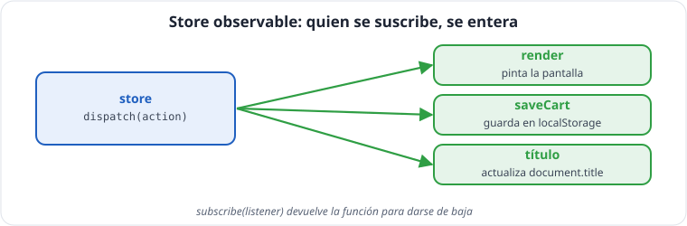
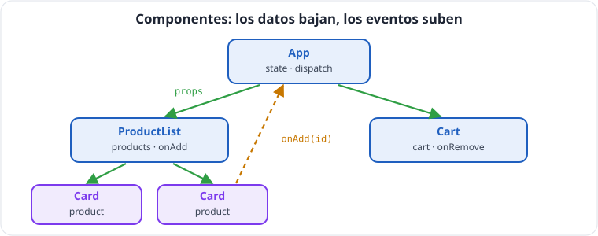

# Unidad 8 · Patrones profesionales y puente a React

*Apuntes de **Isaías FL** · Desarrollo Web en Entorno Cliente · 2.º DAW · Curso 2026‑27*

> **Qué vas a aprender:** un **store observable** (la idea de los gestores de estado), las **clases** en su justa medida, el mapa de **patrones de empresa** que ya has usado, los **componentes** escritos a mano y, por último, cómo todo eso se convierte en **React** con TypeScript: JSX, props, `useReducer`, `useState` y `useEffect`.

---

## Índice

1. [El store observable](#1-el-store-observable)
2. [Clases, lo justo](#2-clases-lo-justo)
3. [Mapa de patrones de empresa](#3-mapa-de-patrones-de-empresa)
4. [Componentes: funciones que devuelven pantalla](#4-componentes-funciones-que-devuelven-pantalla)
5. [Lo que hay debajo de JSX](#5-lo-que-hay-debajo-de-jsx)
6. [El primer proyecto React](#6-el-primer-proyecto-react)
7. [JSX: las reglas](#7-jsx-las-reglas)
8. [Estado en React: `useState` y `useReducer`](#8-estado-en-react-usestate-y-usereducer)
9. [Efectos: `useEffect`](#9-efectos-useeffect)
10. [Tabla de traducción: de octubre a React](#10-tabla-de-traducción-de-octubre-a-react)
11. [Autoevaluación](#11-autoevaluación)

---

## 1. El store observable



En vez de que una función `dispatch` sepa todo lo que hay que hacer tras un cambio (pintar, guardar...), **cada interesado se suscribe** y el store **avisa** a todos.

```ts
type Listener<E> = (state: E) => void;

interface Store<E, A> {
  getElement: () => E;
  dispatch: (action: A) => void;
  subscribe: (listener: Listener<E>) => () => void;   // devuelve la función para darse de baja
}

function createStore<E, A>(reducer: (state: E, action: A) => E, initial: E): Store<E, A> {
  let state = initial;
  const listeners = new Set<Listener<E>>();
  return {
    getElement: () => state,
    dispatch: (action) => {
      const next = reducer(state, action);
      if (next === state) return;               // nada cambió: nadie se entera
      state = next;
      listeners.forEach((listener) => listener(state));
    },
    subscribe: (listener) => {
      listeners.add(listener);
      return () => {
        listeners.delete(listener);
      };
    },
  };
}

type CounterAction = { type: 'add'; quantity: number } | { type: 'reset' };
const reduceCounter = (n: number, a: CounterAction): number => (a.type === 'add' ? n + a.quantity : 0);

const visits = createStore(reduceCounter, 0);
const unsubscribe = visits.subscribe((n) => console.log('pantalla:', n));
visits.subscribe((n) => console.log('guardar:', n));
visits.dispatch({ type: 'add', quantity: 5 });   // pantalla: 5 · guardar: 5
unsubscribe();
visits.dispatch({ type: 'add', quantity: 1 });   // guardar: 6
```

- `E` (estado) y `A` (acciones) son **genéricos**: el store sirve para cualquier aplicación.
- `subscribe: (listener) => () => void` se lee: *«recibe un oyente y devuelve una función sin parámetros»*.

> [!NOTE]
> **En la empresa:** Es el patrón **Observer** (publicador/suscriptor). `addEventListener` es Observer; **Redux** y **Zustand** son este store en versión industrial; y un componente React «se suscribe» al estado que usa.

---

## 2. Clases, lo justo

React moderno usa funciones, pero las clases aparecen en librerías, en Angular, en Java... y para crear **errores propios**.

```ts
class Account {
  #balance = 0;                          // # = privado de verdad (JavaScript)
  readonly owner: string;
  static readonly MAX = 10_000;     // propiedad de la CLASE, no de cada objeto

  constructor(owner: string) {
    this.owner = owner;
  }

  get balance(): number {                // getter: se lee como propiedad (cuenta.saldo)
    return this.#balance;
  }

  deposit(quantity: number): void {
    if (quantity <= 0 || this.#balance + quantity > Account.MAX) {
      throw new RangeError('Cantidad no válida');
    }
    this.#balance += quantity;
  }
}

const isaiasAccount = new Account('Isaías FL');
isaiasAccount.deposit(150);
console.log(isaiasAccount.owner, isaiasAccount.balance);   // 'Isaías FL' 150
// isaiasAccount.#saldo = 1e6; (error) inaccesible desde fuera
```

| | Significado |
|---|---|
| `new Account(...)` | crea un objeto (una **instancia**) |
| `function Object() { [native code] }` | se ejecuta al crearla |
| `#field` | privado **de JavaScript**: inaccesible en ejecución |
| `private field` | privado **solo para TypeScript**: se borra al compilar |
| `get x()` | se lee como una propiedad |
| `static` | pertenece a la clase, no a cada objeto |

> [!WARNING]
> **Atención:** La forma corta `function Object() { [native code] }(private owner: string) {}` **no compila** en los proyectos Vite actuales (`erasableSyntaxOnly`). Declara los campos y asígnalos en el constructor.
> **Atención:** Si pasas un método **suelto** (`const f = count.deposit; f(10)`), pierde su `this` y falla. Es una de las razones por las que React prefiere funciones.

### Herencia útil: errores propios

```ts
class ValidationError extends Error {
  readonly field: string;
  constructor(field: string, message: string) {
    super(message);                    // llama al constructor de Error (obligatorio, antes de usar this)
    this.name = 'ErrorValidacion';
    this.field = field;
  }
}

try {
  throw new ValidationError('price', 'debe ser mayor que 0');
} catch (error) {
  if (error instanceof ValidationError) {
    console.log(`Error en ${error.field}: ${error.message}`);   // narrowing con instanceof
  }
}
```

> [!IMPORTANT]
> **Clave:** En el front moderno se prefiere **composición** (combinar funciones y objetos pequeños) a jerarquías de clases. `extends Error` es el caso en que la herencia es la herramienta correcta.

---

## 3. Mapa de patrones de empresa

**Ya los has usado todos.** Aquí tienen su nombre:

| Patrón / principio | En una frase | Dónde lo usaste |
|---|---|---|
| **Funciones puras** | misma entrada → mismo resultado, sin efectos | todo el dominio |
| **Inmutabilidad** | no se modifica: se crea una copia | CRUD inmutable, reductor |
| **Capas / arquitectura hexagonal** | el núcleo no conoce los detalles técnicos | `domain/` · `ui/` · `services/` |
| **Módulo** | cada fichero expone solo lo público | barriles, DTO sin exportar |
| **Factory** | función que crea objetos ya configurados | `createCounter`, `createStore` |
| **Adapter** | traduce una interfaz ajena a la tuya | `adaptProduct` |
| **Repository / Service** | oculta de dónde vienen los datos | `services/api.ts`, `storage.ts` |
| **Observer** | los interesados se suscriben y son avisados | `addEventListener`, `store.subscribe` |
| **Reducer** | `(state, action) → newState` | `reducer` |
| **Única fuente de verdad** | cada dato vive en un solo sitio | estado + `render` |
| **Estado derivado / selectores** | lo que se puede calcular no se guarda | `visibleProducts`, `cartTotal` |
| **Guard clauses** | descartar lo malo primero con `return` | todas las funciones |
| **Validar en la frontera** | lo de fuera es `unknown` hasta comprobarlo | formularios, `localStorage`, API |
| **Composición antes que herencia** | combinar piezas pequeñas | `allOf(...predicates)`, componentes |

**SOLID en una línea cada uno** (lo oirás en entrevistas):

- **S** — *Single responsibility*: cada módulo, una responsabilidad.
- **O** — *Open/closed*: añadir funcionalidad sin modificar lo que funciona (un suscriptor nuevo).
- **L** — *Liskov*: un subtipo debe poder usarse donde se espera el tipo base (`HttpError` donde se espera `Error`).
- **I** — *Interface segregation*: interfaces pequeñas y concretas (cada componente, sus props).
- **D** — *Dependency inversion*: el núcleo no depende de los detalles (`domain/` no importa `services/`).

**Ejemplo comentado: dos patrones en pocas líneas.**

```ts
// FACTORY: una función que crea objetos ya configurados y coherentes
function createProduct(name: string, price: number): Product {
  return { id: Date.now(), name: name.trim(), price, category: 'peripherals', stock: 0 };
}

// ADAPTER: traduce un objeto con otra forma a nuestro tipo
interface SupplierItem { title: string; cost: number }   // así lo manda un proveedor
const fromSupplier = (item: SupplierItem): Product => ({
  id: 0, name: item.title, price: item.cost, category: 'audio', stock: 1,
});

console.log(createProduct('  Webcam de Isaías ', 50), fromSupplier({ title: 'Cascos', cost: 30 }));
```

---

## 4. Componentes: funciones que devuelven pantalla



Un **componente** es una función que recibe **props** (un objeto con datos y funciones) y **devuelve** un trozo de interfaz. No modifica nada: devuelve.

```ts
interface CardProps {
  product: Product;
  onAdd: (id: number) => void;    // callback: «avisa cuando pase algo»
}

function Card({ product, onAdd }: CardProps): HTMLElement {
  const li = document.createElement('li');
  li.className = 'card';
  const text = document.createElement('span');
  text.textContent = `${product.name} · ${product.price.toFixed(2)} €`;
  const button = document.createElement('button');
  button.textContent = 'Añadir';
  button.disabled = product.stock === 0;
  button.addEventListener('click', () => onAdd(product.id));
  li.append(text, button);
  return li;
}

function ProductList({ products, onAdd }: { products: readonly Product[]; onAdd: (id: number) => void }): HTMLElement {
  const ul = document.createElement('ul');
  ul.append(...products.map((p) => Card({ product: p, onAdd })));   // composición
  return ul;
}

const screen = ProductList({ products, onAdd: (id) => console.log('Isaías añade', id) });
console.log(screen.children.length);
```

> **Los datos bajan por props; los eventos suben por callbacks.** `Card` no sabe qué es un carrito: solo avisa «me han pulsado con este id». Quien la usa decide qué hacer.

```
              App   (conoce el estado y despachar)
             /    \
   ListaProductos  Carrito
         |
    Tarjeta × N
```

---

## 5. Lo que hay debajo de JSX

Escribir `createElement` a mano es largo. Una función auxiliar `h(label, props, ...children)` lo simplifica, y **React tiene una casi idéntica**:

```ts
interface Props { className?: string; disabled?: boolean; onClick?: () => void }

function h<K extends keyof HTMLElementTagNameMap>(label: K, props: Props = {}, ...children: (Node | string)[]): HTMLElementTagNameMap[K] {
  const el = document.createElement(label);
  if (props.className !== undefined) el.className = props.className;
  if (props.disabled === true) el.setAttribute('disabled', '');
  if (props.onClick !== undefined) el.addEventListener('click', props.onClick);
  el.append(...children);       // los textos entran como texto: seguro frente a XSS
  return el;
}

const card = h('li', { className: 'card' },
  h('span', {}, 'Teclado mecánico'),
  h('button', { onClick: () => console.log('añadido') }, 'Añadir'),
);
console.log(card.outerHTML);
```

Y esto es lo mismo en **JSX** (React):

```tsx
<li className="card">
  <span>Teclado mecánico</span>
  <button onClick={() => console.log('añadido')}>Añadir</button>
</li>
```

> **JSX no es HTML**: al compilar se convierte en llamadas a una función como `h`. Por eso se escribe `className` y los eventos reciben **funciones**.

### Lo que React añade

Si en cada cambio reconstruimos **toda** la pantalla (`root.replaceChildren(App(state))`), el `<input>` donde escribías se sustituye por otro nuevo y **pierde el foco**. React también «reconstruye», pero **en memoria**; después **compara** con lo anterior y **solo toca en el DOM lo que ha cambiado** (*reconciliación*). Esa es su gran aportación.

---

## 6. El primer proyecto React

```bash
npm create vite@latest techstore-react -- --template react-ts
cd techstore-react
npm install
npm run dev
```

```
techstore-react/
├── index.html            ← <div id="root"></div>
├── tsconfig.app.json     ← el de tu código: como el de vanilla-ts + "jsx": "react-jsx"
├── vite.config.ts        ← activa el plugin de React
└── src/
    ├── main.tsx          ← arranca React
    └── App.tsx           ← componente principal
```

- **`.tsx`**: TypeScript con JSX. Un fichero con JSX debe ser `.tsx`.
- `npm run build` ejecuta `tsc -b && vite build`: comprueba tipos y construye.

```tsx
// src/main.tsx — sin "!": comprobamos como siempre
import { StrictMode } from 'react';
import { createRoot } from 'react-dom/client';
import { App } from './App';
import './index.css';

const root = document.getElementById('root');
if (root === null) {
  throw new Error('Falta el elemento #root en index.html');
}

createRoot(root).render(
  <StrictMode>
    <App />
  </StrictMode>,
);
```

Y la recompensa del trabajo por capas: **`domain/` y `services/` se copian al proyecto React sin cambiar una línea**.

---

## 7. JSX: las reglas

```tsx
import type { Product } from '../domain';

interface CardProps {
  product: Product;
  onAdd: (id: number) => void;
}

export function Card({ product, onAdd }: CardProps) {
  return (
    <li className="card">
      <span>
        {product.name} · {product.price.toFixed(2)} €
      </span>
      <button type="button" disabled={product.stock === 0} onClick={() => onAdd(product.id)}>
        Añadir
      </button>
    </li>
  );
}
```

| # | Regla | Ejemplo |
|---|---|---|
| 1 | Las etiquetas se escriben como HTML | `<li>...</li>` |
| 2 | Las **llaves** meten JavaScript | `{product.name}` |
| 3 | `className` (no `class`), `htmlFor` (no `for`) | `<li className="card">` |
| 4 | Los eventos reciben **una función** | `onClick={() => onAdd(id)}` |
| 5 | Un solo elemento raíz (o un fragmento `<>...</>`) | `return <>...</>` |
| 6 | Las listas llevan `key` única | `list.map((p) => <Card key={p.id} ... />)` |

- Los componentes empiezan por **mayúscula** (`Card`).
- La `interface XProps` es el **contrato** del componente: si falta una prop obligatoria, TypeScript da error (*«Property 'alAnadir' is missing...»*).
- No se anota el tipo de retorno del componente: TypeScript lo infiere.
- `{product.name}` se pinta **como texto**: React te protege del XSS.

```tsx
// Renderizado condicional y listas
export function Lista({ products }: { products: readonly Product[] }) {
  if (products.length === 0) return <p>Sin productos</p>;
  return (
    <ul>
      {products.map((p) => (
        <li key={p.id}>
          {p.name} {p.stock === 0 && <strong>(agotado)</strong>}
        </li>
      ))}
    </ul>
  );
}
```

---

## 8. Estado en React: `useState` y `useReducer`

### `useState`: valores sencillos

**Ficha técnica · `useState`**

| | |
|---|---|
| **Firma** | `const [value, setValue] = useState<T>(initial)` |
| **`initial`** | el valor inicial, o una **función** `() => T` que lo calcula (se ejecuta solo la primera vez) |
| **Devuelve** | una tupla: `[value actual, función para cambiarlo]` |
| **`setValue`** | `setValue(next)` o `setValue((previous) => next)`. Si el nuevo valor es **igual** (`Object.is`) al anterior, React no repinta |
| **Cuándo cambia** | en el **siguiente** pintado: justo después de `setValue`, la variable `value` sigue teniendo el valor viejo |
| **Regla** | los *hooks* se llaman siempre en el **nivel superior** del componente: nunca dentro de `if`, bucles ni funciones internas |

```tsx
import { useState } from 'react';

export function Counter() {
  const [count, setCount] = useState(0);          // tupla: [valor, función para cambiarlo]
  return (
    <button type="button" onClick={() => setCount((n) => n + 1)}>
      Isaías ha pulsado {count} veces
    </button>
  );
}
```

- `useState(0)` infiere `number`. Para estados que empiezan vacíos, indica el tipo: `useState<Product[]>([])`, `useState<Product | null>(null)`.
- `setCount((n) => n + 1)`: la forma con función usa el valor **más reciente**.
- **Nunca** mutes: `setList([...list, newItem])`, no `list.push(newItem)`. React compara con `===`: si mutas, **no repinta**.

### `useReducer`: el reductor de octubre

**Ficha técnica · `useReducer`**

| | |
|---|---|
| **Firma** | `const [state, dispatch] = useReducer(reducer, initialArg, init?)` |
| **`reducer`** | `(state: E, action: A) => E`: función **pura** |
| **`initialArg`** | el estado inicial, o el argumento que recibe `init` |
| **`init`** (opcional) | `(arg) => E`: calcula el estado inicial **una sola vez** |
| **Devuelve** | `[state actual, dispatch]`; `dispatch(action)` no devuelve nada y su identidad es estable |

```tsx
import { useReducer } from 'react';
import { initialState, visibleProducts, reducer } from './domain';
import { Card } from './components/Card';

export function App() {
  const [state, dispatch] = useReducer(reducer, initialState);
  return (
    <>
      <input
        type="search"
        value={state.filter}                                              // controlado: manda el estado
        onChange={(e) => dispatch({ type: 'filter', text: e.target.value })}
      />
      <ul>
        {visibleProducts(state).map((p) => (
          <Card key={p.id} product={p} onAdd={(id) => dispatch({ type: 'buy', id })} />
        ))}
      </ul>
    </>
  );
}
```

- **El mismo `reducer`** que escribiste para el DOM. React pone el estado, `dispatch` y el repintado.
- **Input controlado:** `value={state.filter}` hace que el input muestre lo que dice el estado (única fuente de verdad). Y no pierde el foco, porque React reutiliza el mismo elemento.
- En `onChange`, `e.target.value` ya es `string`: React sabe que el evento viene de un `<input>`.
- `onChange` de React se dispara **con cada tecla** (como el evento `input` del DOM).

---

## 9. Efectos: `useEffect`

**Ficha técnica · `useEffect`**

| | |
|---|---|
| **Firma** | `useEffect(effect, dependencias?)` |
| **`effect`** | <code>() =&gt; void &#124; (() =&gt; void)</code>: puede devolver una función de **limpieza** |
| **Cuándo se ejecuta** | **después** de pintar en pantalla |
| **`dependencias`** | array de valores; el efecto se repite si alguno cambia (`Object.is`). `[]`: solo al montar. Sin array: tras **cada** pintado |
| **Limpieza** | se ejecuta antes de repetir el efecto y al desmontar el componente |
| **En desarrollo con `StrictMode`** | monta, desmonta y vuelve a montar: el efecto se ejecuta dos veces para detectar limpiezas que faltan |
| **No es `async`** | el efecto no puede ser `async` (devolvería una promesa, no una limpieza). Usa una función `async` dentro o `.then` |

Un componente debe ser **puro** (datos → pantalla). Lo que no es pintar (pedir datos, guardar, temporizadores) es un **efecto**:

```tsx
import { useEffect, useState } from 'react';
import { loadCatalog } from './services/api';
import { errorMessage } from './services/http';
import type { LoadState, Product } from './domain';

export function Catalogo() {
  const [state, setState] = useState<LoadState<readonly Product[]>>({ type: 'loading' });
  const [attempt, setAttempt] = useState(0);

  useEffect(() => {
    const controller = new AbortController();
    setState({ type: 'loading' });
    loadCatalog({ signal: controller.signal })
      .then((data) => setState({ type: 'ready', data }))
      .catch((error: unknown) => {
        if (!controller.signal.aborted) setState({ type: 'error', message: errorMessage(error) });
      });
    return () => controller.abort();          // limpieza: cancela si se repite o se desmonta
  }, [attempt]);                               // se repite solo cuando cambia "intento"

  if (state.type === 'loading') return <p>Cargando…</p>;
  if (state.type === 'error') {
    return <button type="button" onClick={() => setAttempt((n) => n + 1)}>Error: {state.message} · Reintentar</button>;
  }
  return <p>{state.data.length} productos en TechStore Isaías FL</p>;
}
```

| Parte | Significado |
|---|---|
| `useEffect(fn, [deps])` | ejecuta `fn` **después** de pintar, y de nuevo cuando cambie alguna dependencia |
| `[]` | solo al montar el componente |
| sin array | **tras cada pintado** **Atención:** (bucle infinito de peticiones si cambias estado dentro) |
| `return () => ...` | **limpieza**: antes de repetir el efecto o al quitar el componente |

> [!TIP]
> **Consejo:** En desarrollo, `<StrictMode>` monta, desmonta y vuelve a montar cada componente para detectar efectos sin limpieza. Por eso el `AbortController` y la comprobación `signal.aborted` son imprescindibles.

---

## 10. Tabla de traducción: de octubre a React

| Lo que hiciste en octubre | En React |
|---|---|
| `interface XProps` + `function X(props): HTMLElement` | igual, devolviendo JSX |
| `h('li', { className }, ...)` | `<li className="...">...</li>` |
| `list.map((p) => Card({...}))` | `list.map((p) => <Card key={p.id} ... />)` |
| `let counter` en un closure | `const [counter, setCounter] = useState(0)` |
| `createStore(reducer, initial)` + `subscribe(render)` | `useReducer(reducer, initial)` |
| suscriptor que guarda en `localStorage` | `useEffect(() => save(cart), [cart])` |
| `load()` + `AbortController` | `useEffect(() => { ...; return () => abort(); }, [])` |
| `root.replaceChildren(App(state))` | React lo hace solo, y solo con lo que cambia |
| `domain/` y `services/` | **se copian tal cual** |

---

## 11. Autoevaluación

- [ ] ¿Qué devuelve `store.subscribe(listener)` y para qué sirve?
- [ ] ¿Qué diferencia hay entre `#field` y `private field`?
- [ ] ¿En qué capa va un adaptador de la API y qué patrón es?
- [ ] Completa: «Los datos ______ por props; los eventos ______ por callbacks».
- [ ] ¿En qué se convierte el JSX al compilar?
- [ ] ¿Por qué cada elemento de una lista necesita `key`?
- [ ] ¿Qué pasa si mutas un array del estado en lugar de crear uno nuevo?
- [ ] ¿Qué hace la función que devuelve un `useEffect`?
